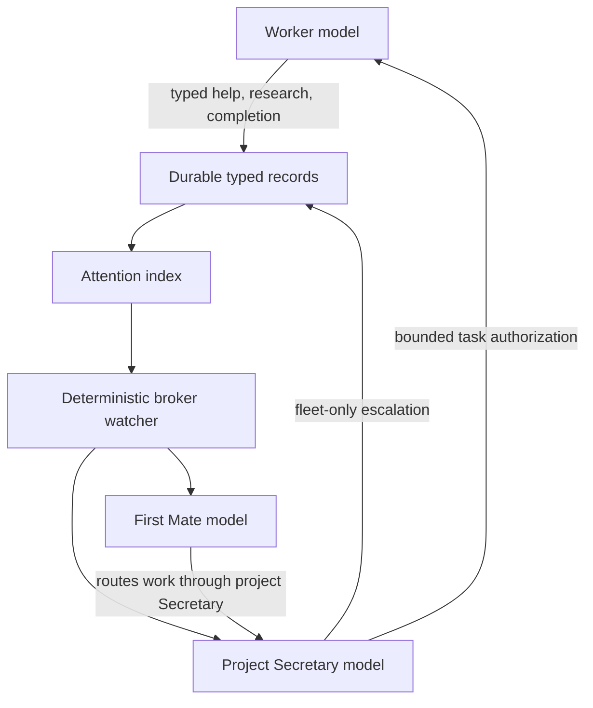

# Pisec v1 Finalization Plan

Status: implementation contract; not implementation authorization

Scope: finish, simplify, harden, cut over, and validate Pisec v1

Prepared: 2026-08-25

Repository: `/home/j/dotfiles`

## 1. Purpose

This document is the complete implementation plan for Pisec v1. It replaces
the scattered architectural suggestions, audits, and interim plans that led to
it. An implementation agent should not invent additional product behavior or
choose among alternate architectures. The decisions below are final unless the
user explicitly changes them.

The desired result is a small, understandable, single-node agent control plane
with these properties:

1. A human authorizes one exact worker task and later accepts one exact
   candidate.
2. A project Secretary supervises every project. A First Mate supervises only
   projects deliberately placed in a fleet.
3. Workers communicate upward through typed durable records. Models do not use
   arbitrary direct messages for ordinary work.
4. A deterministic broker notices durable records and wakes the right model.
   The broker does not classify prose and does not contain another supervisor
   model.
5. A stopped or idle process is never mistaken for completed work.
6. Workers can always make local commits without Pisec injecting Git, SSH,
   signing, cloud, auth-broker, or provider credentials. Human-approved data
   paths remain an explicit readable-data exception, not an automatic
   secret-free claim.
7. Runtime refresh and permission changes have truthful, guarded states.
8. The final database has one current schema and no migration chain.
9. Unsupported and misleading code, tests, guidance, platform claims, and
   deployment machinery are removed.
10. Default human-facing output explains outcomes, consequences, and required
    decisions. Machine identifiers remain available in JSON and diagnostic
    detail, but are not the normal vocabulary.

## 2. How the implementation agent must use this plan

- Execute the phases in order. Do not combine phases merely because the same
  file appears in more than one phase.
- Preserve the user's current dirty work. Do not reset, restore, or discard it.
- Do not run the installer, updater, or live database reset from a dirty or
  uncommitted checkout.
- Do not delegate write work from the current stale `HEAD`. Read-only review is
  allowed. Written delegation starts only after the first green baseline
  commit described below.
- End every phase with its specified tests. A later phase does not excuse a
  failure introduced by an earlier phase.
- Use one coherent commit at each stated commit boundary. Do not push unless
  the user explicitly requests it.
- Do not add compatibility shims, generic frameworks, abstract queues,
  telemetry stores, preference stores, or new user-facing features unless this
  plan explicitly requires them.
- When a failure cannot be represented truthfully, stop with
  `needs_attention`. Do not guess, silently retry using another interface, or
  report success for a launched-but-unconfirmed effect.
- The live cutover in Phase 10 is destructive to active Pisec state even though
  the old state is archived. It requires a separate, explicit operator go-ahead
  after the code and tests are complete.

## 3. Final decisions

These choices are not left to the implementation agent.

### 3.1 Supervision

- Every active project has exactly one active project Secretary.
- A project uses one of two supervision modes: `project` or `fleet`.
- `project` means its Secretary is the highest automatic supervisor.
- `fleet` means its Secretary may escalate project-level problems to the one
  active First Mate.
- Remove `direct` mode. Existing behavior that meant “no automatic
  supervision” is not part of v1.
- The First Mate is a model supervisor. It is not replaced by deterministic
  code.
- The broker's watcher is deterministic scheduling code. It is not a model and
  does not interpret meaning.
- Do not add a model between the watcher and the First Mate.
- Do not add a watcher over the First Mate.
- Do not add a separate hidden supervision conversation in v1. Wakes enter the
  recipient's existing runtime through one small fixed prompt.
- Define that prompt once as `ATTENTION_WAKE_PROMPT` in
  `scripts/pisec/attention.py`. Every watcher, adapter, test, and document uses
  that constant or its generated value; no second prompt literal is allowed.



### 3.2 Meaning and classification

- Models classify free-form user or worker meaning before they call a Pisec
  tool.
- Pisec does not run a second classifier over prose.
- Deterministic behavior begins when the model selects a typed operation and
  an enum value.
- `help.request` is the single worker-facing upward-help facade. It is not the
  universal storage format.
- `clarification`, `blocker`, and `review` create coordination records.
- `access`, `permission`, `tooling`, and `lifecycle` create issue records.
- Research, completion, decisions, issues, integration, and authorization keep
  their own typed records.
- Do not add `communication.send`, arbitrary durable chat, generic message
  bodies, threading, `supersedes`, or semantic text deduplication.

### 3.3 Asynchronous attention

- Source records remain authoritative.
- Add one small `attention_items` table that points to source records.
- The table contains no copied source body, generic message payload, handled
  flag, lease, delivery job, retry error log, or model-generated summary.
- The in-memory scheduler state is only an accelerator. A periodic database
  rescan guarantees eventual discovery after dropped hints or process restart.
- Delivery is at least once. Duplicate wake prompts are safe.
- A prompt accepted by Herdr is not called “received,” “handled,” “answered,”
  or “resolved.”
- No generic attention acknowledgement is required. The typed source action is
  the acknowledgement.

### 3.4 Worker Git layout

- Replace the linked-worktree plus split private-object arrangement with one
  independent local Git repository per worker.
- Each worker repository has its own `HEAD`, refs, index, configuration, and
  object store. The primary repository is not mutated during worker creation or
  worker commits.
- Resolve a canonical local base branch and exact base commit under the project
  Git lock, create a non-hardlinked single-branch/no-tags local clone, check out
  the exact commit on `pisec/<workstream-id>/work`, retain only the inert
  review-only base refs described in Section 10.9, and remove every remote and
  transport configuration before launch.
- The increased disk usage is accepted for v1. Do not add alternates,
  hardlinks, shared object stores, partial clone, automatic garbage collection,
  or deduplicating storage.
- After human acceptance, the broker imports the exact candidate through a
  temporary namespaced ref, revalidates it, and performs only `ff-only`
  integration.
- Retirement preserves an unintegrated worker repository. Automatic cleanup
  refuses it. Successful integration permits cleanup because the accepted
  scope's final receipt commit is then reachable from the target repository.
- Delete the custom private-object manager and its database/runtime fields
  after the replacement path passes all tests.

This decision removes the structural condition in which a shared branch ref
can point at a commit visible only through Pisec's special object environment.
That condition is a plausible cause of the previously observed broken worker
`HEAD` and unreadable branch behavior.

### 3.5 Worker Git identity and credentials

- Worker commits use the fixed identity
  `Pisec Worker <pisec-worker@invalid>` for both author and committer.
- Project Secretary commits use
  `Pisec Secretary <pisec-secretary@invalid>`.
- v1 agent commits are unsigned.
- Repository hooks do not run inside Pisec-managed Git operations.
- Pisec injects no SSH agent, Git credential helper, GitHub token, GPG key,
  cloud credential, credential-bearing remote, or upstream model-provider
  credential into a worker.
- Workers never push.
- Authenticated publication is a host-side, Secretary-authorized broker
  operation over a credential-free registered remote URL.
- The control database stores no authentication secret.
- Keep two visibly different capabilities. The Pisec control token is random
  per binding and authenticates only that binding to the Pisec runtime socket.
  The OMP auth-gateway client token is one shared host-generated token accepted
  only by the loopback inference gateway. v1 deliberately permits all Pisec
  roles to read that shared client token; it is not binding isolation and must
  never be described as such. The upstream auth-broker/provider credential
  remains host-side and is never copied into a role runtime.
- Remove raw copying of `~/.omp/agent/config.yml` into fenced runtimes. Pisec
  must generate the role configuration it needs from explicit safe inputs.
- Do not build a credential vault, signing service, per-binding gateway proxy,
  or broad repository secret scanner in v1.

### 3.6 Runtime surfaces and refresh

- One public operation captures one immutable, verified runtime-surface
  snapshot per harness at its beginning.
- The same object is passed through desired-generation calculation,
  materialization, policy rendering, binding, launch, and verification.
- No step reacquires “current” midway through the operation.
- A refresh reserves the binding before stopping it.
- Reconciliation and turn preparation honor the reservation.
- `upgraded` means a newly started runtime has authenticated and attested the
  exact reserved generation.
- `startup_in_progress` means launch occurred but attestation has not arrived.
- `needs_attention` means the result is not safely classifiable or failed.
- Keep current polling for v1. Polling efficiency is not a correctness change.

### 3.7 Permission changes

- Project permission replacement remains exact and project-wide.
- Applying a replacement is a staged, all-target operation.
- Resolve harnesses by affected workstream ID, never project ID.
- Preflight and stage every affected binding before modifying active
  permissions.
- Reserve every affected idle binding before stopping any of them.
- If any binding is busy, invalid, or cannot be staged, change nothing.
- Activate the new project permissions and staged profiles only after all
  staging succeeds.
- Report `succeeded` only after every affected runtime attests the new
  generation.
- If activation or attestation fails, stop candidate runtimes, restore the old
  project permissions and old binding artifacts with guarded updates, and
  attempt to relaunch the old generation.
- If restoration cannot be fully confirmed, retain the old permission record,
  leave uncertain bindings stopped, and mark the operation and workstreams
  `needs_attention`. Never claim that nothing happened to process uptime, and
  never leave a stale broader policy running.

### 3.8 Human decision boundary

- v1 always requires the human to authorize the exact worker delegation and
  requires human acceptance before any completion candidate is integrated.
  A worker retired through the bounded remediation-failure form in Section
  10.6 has no accepted or integrated candidate; that form retains all Git
  material and does not manufacture the second decision.
- Remove project `worker_creation_policy`, `worker_creation_policy_json`,
  `merge_policy`, and `merge_policy_json` fields and the public
  `project.policy.update` operation. `bounded_auto` and `checked_auto` are not
  dormant v1 modes: exact worker delegation and pre-integration candidate
  acceptance are invariant human gates.
- Secretary-owned integration after acceptance requires no third merge
  approval, but remains bounded by the already consumed acceptance.
- Current project configuration consists of registration identity,
  supervision mode, and exact readable path/domain permissions. Do not add a
  generic project-policy JSON replacement.

### 3.9 Database lifecycle

- The final database identity is `schema_name = "pisec-core-v1"` and
  `schema_version = 1`.
- The configuration-file format remains separately named as configuration
  format version 3.
- The final source contains no previous-schema constants, in-place migration
  functions, topology migrations, historical table builders, or supported
  predecessor.
- Opening a database with any other name, version, or schema digest fails
  without altering it.
- Old state is handled only through explicit archive-and-reset.
- The cutover archives the complete old state before initializing v1. It does
  not migrate tasks, sessions, workers, issues, events, or runtime bindings.
- Active project registrations, modes, and permissions are exported for human review and
  re-created through normal v1 commands after reset. The repository does not
  retain a legacy importer.

### 3.10 Deployment recovery

- Keep the active deployment and one previously verified deployment.
- Do not delete the previous verified bundle until the new bundle passes
  doctor, runtime refresh, and reconciliation.
- Do not roll back automatically.
- Provide one explicit `pisec update --recover-previous` operator action.
- Recovery verifies the retained bundle digest and exact database compatibility
  before changing `current`. It refuses an incompatible database.
- A failed candidate may remain current and `needs_attention`; the retained
  bundle is recovery evidence, not a second active runtime surface.
- The incompatible pre-v1 archive is never a runtime rollback target. The
  controlled cutover first verifies the Phase 8 v1 deployment and then deploys
  the final Phase 9 commit, making Phase 8 the one real schema-compatible
  predecessor. Do not manufacture a fake recovery guarantee across reset.

### 3.11 Product and platform boundary

- Full fenced Pisec v1 is Linux-only.
- macOS supports shared dotfiles synchronization and shared skills only.
- Delete active Pisec launchd generation and probe code that implies otherwise.
- Keep a fail-closed macOS full-install stub and its no-mutation test.
- OMP and Codex are supported worker harnesses only when their route validates
  at startup and doctor. OpenCode is not a Pisec worker default.
- The v1 acceptance matrix pins exact tested integrations: OMP `17.3.4`, Codex
  `0.147.0`, Herdr `0.8.0` with protocol `19`, Fence `0.1.66`, Collie `0.28.0`
  plus the committed unread-activity patch, and Herdr Reviewr `0.32.1`.
  Remove `compatible` and `0.8.x` range labels from active manifests. A later
  dependency upgrade is a separate bounded compatibility change with adapter,
  installer, doctor, and live-smoke evidence; v1 does not silently accept a
  nearby version.

## 4. Exact state vocabulary

Use these terms in code, docs, tool descriptions, CLI output, and tests.

| Term | Exact meaning |
|---|---|
| recorded | The source record, event, and attention update committed in one database transaction. |
| wake hinted | A lossy in-memory signal told the watcher to rescan. This is not durable state. |
| prompt accepted | The workspace adapter accepted the fixed wake prompt. This does not prove a model turn began. |
| presented | `runtime.turn.prepare` included the current attention revision in a model turn and recorded that fact. |
| inspected | A model requested the typed source through its list/inspect operation. This remains a read, not a lifecycle transition. |
| claimed | A typed workflow explicitly assigned work, such as a Secretary claiming research. |
| answered | A typed response record was committed. |
| acknowledged | The intended recipient explicitly acknowledged a typed answer where that workflow requires it. |
| working | An authenticated model turn is executing. This is runtime activity, not task progress or completion. |
| blocked | The authenticated harness is held at an approval/question/tool boundary. It becomes a durable task blocker only if a typed Pisec help/issue record says so. |
| idle | The authenticated runtime is live and no model turn is executing. Pending task or attention work may still exist. |
| done | A Herdr/Collie presentation spelling only; Pisec never persists it as task or runtime completion. |
| ready_review | Atomic completion submission committed the current validated candidate, matching checkpoint, event, and Secretary attention. It is not accepted. |
| accepted | The human approved the exact immutable candidate and effects. It is not yet integrated or completed. |
| resolved | The typed workflow reached its terminal semantic state. |
| completed | The exact accepted candidate was verified, integrated `ff-only`, and the merge receipt/completion operation committed. Runtime idleness, `done`, process death, Reviewr state, or a checkpoint alone can never produce it. |
| retired | Guarded runtime stop/closure committed and the workstream can take no more task actions. Checkout/runtime cleanup is still separate. |
| cleaned | The removable checkout/runtime material was deleted after its retention conditions were satisfied. |

Do not use `received`, `processed`, or `handled` as database states in v1. They
combine several distinct meanings and caused the original ambiguity.

`setting_up`, `supervising`, `active`, `reconciling`, `integrating`, and
`needs_attention` are deterministic read-only `taskState` board phases defined
in Section 11.4, not additional stored enums. Durable truth remains in the
workstream, checkpoint/completion, acceptance, integration, operation, and
attention records.

## 5. Final role routing

### 5.1 Worker-originated records

| Worker action | Durable source | Recipient | Required recipient action |
|---|---|---|---|
| `help.request(kind=clarification)` | coordination request | project Secretary | answer or record a linked decision |
| `help.request(kind=blocker)` | blocking coordination request | project Secretary | answer, delegate a bounded remedy, or escalate an issue |
| `help.request(kind=review)` | review coordination request | project Secretary | inspect and answer |
| `help.request(kind=access\|permission\|tooling\|lifecycle)` | issue | project Secretary | acknowledge, remedy, verify, resolve, or escalate |
| research request | research request and packet | project Secretary | claim, request context, answer, or decline |
| completion submission | completion packet | project Secretary | inspect and prepare human acceptance |
| ordinary checkpoint | immutable checkpoint | nobody | no wake |

Worker issues do not notify the First Mate directly. The project Secretary is
the first supervisor and prevents duplicate fleet-level attention.

### 5.2 Secretary-originated records

- An answer to coordination creates worker attention until the worker
  acknowledges it.
- A research context request, answer, or decline creates worker attention until
  the worker provides context or acknowledges the result.
- A Secretary in a fleet project escalates cross-project, recurring,
  infrastructure, or authority-bound problems by reporting an issue to the
  First Mate.
- A Secretary in project mode surfaces unresolved human decisions in its own
  project session; it does not silently create a fleet.
- A Secretary never sends an arbitrary direct prompt to a worker. Integration
  drift, re-verification, and remediation are represented by their typed source
  records and attention.

### 5.3 First Mate records

- The First Mate may list and inspect project status, workstreams,
  integrations, and issues across active fleet projects. Those are read-only
  fleet views.
- First Mate issue lifecycle operations apply only to an escalation issue whose
  reporter is that project's Secretary and whose `escalated_from_issue_id`
  names the worker-reported issue that remains owned by the Secretary.
- For such an escalation, the First Mate may acknowledge it, add context,
  request a bounded remediation from the project Secretary, request reporter
  verification, or resolve a non-fix disposition backed by a decision. It may
  not acknowledge, remediate, verify, or resolve the underlying worker issue.
- The First Mate is authenticated globally. Its workstream's control project
  does not need to equal the affected project.
- Every fleet operation separately checks that the affected project is active
  and in `fleet` mode.
- The project Secretary is the only model role that prepares a project worker,
  presents its creation authorization, prepares candidate acceptance, applies
  acceptance, reconciles target drift, integrates, retires, or cleans it.
- Remove `fleet.workstream.prepare`, `fleet.workstream.authorize_apply`,
  `fleet.workstream.accept.prepare`, and
  `fleet.workstream.accept.apply`. Also remove their exposed tools. Keep the
  fleet workstream/integration/Git views read-only.
- Remove `fleet.project.permissions.prepare`,
  `fleet.project.permissions.apply`, and `fleet.runtime.ensure`. A First Mate
  requests those project effects through the escalation issue; the project
  Secretary performs the existing protected operation and presents any human
  authorization in the project surface.
- Add `fleet.issue.request_remediation`. It records the bounded requested
  outcome, allowed paths, verification, and non-effects as an immutable issue
  update and creates project-Secretary attention. It does not create or link a
  worker. The Secretary creates an authorized worker and then uses
  `issue.link_remediation` to link it to both the escalation and underlying
  worker issue.

### 5.4 Project and supervisor provisioning

Use exactly this lifecycle; do not leave an active project without a
Secretary:

1. `project.register` validates the repository and records an inactive project
   with `active=0`, default `coordination_mode='project'`, and no Secretary.
   Registration performs no workspace or model launch.
2. Remove the public `project.activate` operation. `project.open` is the sole
   activation gate.
3. `project.open` holds the project reconcile lock, creates or repairs the one
   Secretary workstream and binding, proves the runtime has authenticated and
   attested its generation, and only then sets `projects.active=1`. A failure
   leaves the project inactive and the ensure operation retryable or
   `needs_attention`; it never commits `active=1` first.
4. Reopening an active project revalidates the one bound Secretary, repairs it
   through the normal ensure operation if safe, and focuses its Herdr surface.
5. Worker creation, acceptance, permission changes, and project-mode changes
   require an active project and its one bound Secretary.
6. `project.deactivate` first prevents new project operations, stops and
   retires the Secretary through the guarded lifecycle, removes the active
   project workspace binding, and only then sets `active=0`. If shutdown is
   ambiguous, it remains active but `needs_attention` rather than claiming
   deactivation.
7. `first_mate.ensure` remains an explicit admin operation and requires one
   already active project as its control project. It ensures the one global
   First Mate and exact current runtime generation.
8. Changing an active project from `project` to `fleet` refuses unless the
   First Mate is already bound, usable, and unreserved. On success, the
   guarded mode-change transaction changes the mode and schedules bounded
   attention backfill.
   There is no period in which a fleet project has no First Mate.
9. Changing a fleet project back to `project` refuses while it has open
   Secretary escalation issues. It does not automatically retire the global
   First Mate. v1 adds no First Mate retirement operation; once ensured, the
   single global First Mate remains idle and available even when no project is
   currently in fleet mode. Automatic or manual deprovisioning is parked until
   retained-runtime cost demonstrates a real need.

## 6. Final database contract

The retained table inventory below is exhaustive. For a retained table or
column not explicitly changed in this section, preserve its Phase 2 name,
meaning, foreign key, immutability trigger, uniqueness, and bound exactly; do
not redesign it during the fresh-schema rewrite. Remove every table named in
Section 6.2, and add only `attention_items`. The fresh `SCHEMA_SQL`, not a
builder or migration sequence, creates the whole result in one transaction.

### 6.1 Tables retained

| Table | Why it exists |
|---|---|
| `control_meta` | Exact current database identity and digest. |
| `projects` | Registered repository identity, supervision mode, lifecycle gate, and current exact permissions. |
| `project_workspaces` | The one adapter-owned project workspace identity. |
| `workstreams` | Desired task/supervisor lifecycle and approved checkout identity. |
| `runtime_bindings` | Current observed process/runtime binding and generation state. |
| `runtime_sessions` | Per-model-session task-packet presentation state. |
| `retained_session_roots` | Explicit retained model session location after runtime retirement. |
| `task_packets` | Immutable worker intent. |
| `workstream_checkpoints` | Immutable progress evidence. |
| `completion_packets` | Immutable worker completion candidate. |
| `workstream_acceptances` | Immutable human acceptance of one candidate. |
| `integration_jobs` | Current post-acceptance reconciliation/integration state. |
| `integration_reports` | Immutable verification reports for integration attempts. |
| `merge_receipts` | Final exact `ff-only` integration provenance. |
| `coordination_requests` | Typed clarification, blocker, and review requests. |
| `coordination_packets` | Immutable coordination answers. |
| `research_requests` | Current structured research lifecycle. |
| `research_packets` | Immutable research request/context/result packets. |
| `decisions` | Explicit human/model decisions referenced by workflows. |
| `issues` | Current issue lifecycle. |
| `issue_updates` | Immutable issue action history. |
| `issue_remediations` | Explicit issue-to-workstream remediation link. |
| `operations` | Replay-safe multi-step control-plane operations. |
| `authorizations` | One consumed exact human authorization per protected operation. |
| `events` | Immutable, low-volume semantic audit history. |
| `attention_items` | Current delivery index pointing to typed source records. |

### 6.2 Tables removed or renamed

| Current table | v1 action |
|---|---|
| `research_inbox` | Remove; replaced by `attention_items`. |
| `issue_inbox` | Remove; replaced by `attention_items`. |
| `secretary_issue_reports` | Remove; it mirrors `issues` and its triggers duplicate truth. |
| `runtime_bootstrap_sessions` | Rename and simplify to `runtime_sessions`. |
| `access_grants` | Remove; its predecessor migration states and per-grant lifecycle are not v1 truth. Current exact project permissions live on `projects`; authorization/history live in `authorizations`, `operations`, and `events`. |
| `deployment_actions` | Remove; bounded deployment recovery is filesystem updater evidence, not a model remediation table. |
| `runtime_releases` | Remove; immutable runtime surfaces/generations replace release rows. |
| `runtime_release_channels` | Remove; v1 has no runtime release channel selector. |

### 6.3 Required column changes

#### `projects`

- `coordination_mode` accepts only `project` and `fleet`; default `project`.
- Remove `worker_creation_policy`, `worker_creation_policy_json`,
  `merge_policy`, and `merge_policy_json`; the two human authorization gates in
  Section 3.8 are invariant, not configurable project modes.
- `active INTEGER NOT NULL DEFAULT 0 CHECK(active IN (0,1))`.
- Add nullable bounded `lifecycle_attention_reason`. Normal registration and
  successful active/inactive states keep it null. Failed/ambiguous open leaves
  `active=0` with a reason; failed/ambiguous deactivation leaves `active=1`
  with a reason. The controlling operation is also `needs_attention`.
- The common project-writable predicate requires `active=1` and null
  `lifecycle_attention_reason`. A deactivation/open repair may retry under its
  reconcile lock, but no worker, acceptance, mode, or permission operation
  proceeds while the reason is set. Successful repair clears it.
- Retain `data_dirs` and `external_domains` as canonical sorted JSON arrays.
  Together they are the one current project-permission record. Do not create
  per-path grant rows, a permission-history table, or a preference/policy
  table. The protected replacement operation stores old/new canonical values
  and digests; consumed authorization and semantic events provide history.
- Permission comparison always canonicalizes and hashes both arrays together.
  The final batch transaction updates both columns or neither; no caller may
  update one directly.
- Keep `remote_url`, but accept only canonical credential-free HTTPS or
  credential-free SSH Git remotes.
- Reject HTTPS userinfo, SSH passwords, `file:`, `ext::`, local filesystem
  remotes, option-like values, whitespace/control characters, and URLs whose
  canonical form changes unexpectedly.

#### `workstreams`

- Keep `worktree_path` as the checkout path name to limit mechanical churn;
  for workers it now points at the independent worker repository working tree.
- Keep unique project branch and checkout constraints.
- Worker branch remains `pisec/<workstream-id>/work`.
- Add a partial unique index requiring one authoritative `workstream.create`
  operation per workstream. The indexed states are exactly `planned`,
  `applying`, `needs_attention`, and `succeeded`. `failed` and `cancelled`
  attempts are historical and are ignored by the authoritative lookup. A
  `needs_attention` attempt must be repaired or explicitly cancelled before a
  replacement may be created.

#### `runtime_bindings`

- Remove `private_git_object_dir`.
- Retain desired, launch-reserved, and applied generation digests.
- Retain `refresh_pending` as the single durable reservation bit.
- Add `refresh_operation_id` referencing the reserving operation.
- Add `refresh_started_at`.
- Add nullable `session_start_event_sequence REFERENCES events(sequence)`,
  positive nullable `session_start_report_seq`, and nullable
  `session_started_at`. All three are null or non-null together.
- Require both new fields to be null when `refresh_pending=0` and non-null when
  `refresh_pending=1`.
- A usable active runtime requires:
  `refresh_pending=0`, null launch generation, non-null applied generation,
  applied generation equal to desired generation, non-null runtime instance,
  and an authenticated report sequence of at least one plus the matching
  durable session-start evidence below.
- The authenticated `session_start` transaction appends exactly one
  `runtime.session_started` event whose canonical payload contains
  `runtimeInstanceId`, `generationSha256`, and `reportSeq`, then stores that
  event sequence/report sequence/time on the binding while setting the applied
  generation. Beginning any new launch clears the three evidence fields.
  Subsequent reports never rewrite them.

#### `runtime_sessions`

Use exactly these logical fields:

- `workstream_id`
- `session_key`, a normalized bounded harness session identity
- `task_packet_presented_at`, nullable
- `last_turn_started_at`, nullable
- `updated_at`
- primary key `(workstream_id, session_key)`

Remove bootstrap and event-generation counters. Attention presentation belongs
to `attention_items`, not the session table.

Remove `runtime.bootstrap.get` and `runtime.bootstrap.ack` from every socket,
tool, adapter, and test. `runtime.turn.prepare` takes the normalized current
`sessionKey`; in one immediate transaction it verifies the usable runtime,
upserts `runtime_sessions`, returns the immutable task packet only when
`task_packet_presented_at` is null, records that presentation, selects current
attention, and records the selected revisions. There is no separate bootstrap
acknowledgement.

#### `workstream_checkpoints`

- Allowed phases: `investigating`, `implementing`, `verifying`, `ready_review`.
- The ordinary checkpoint operation accepts only `investigating`,
  `implementing`, and `verifying`. `ready_review` is written only by the
  completion-submission operation described below.
- Remove `needs_input`, `blocker_code`, and `blocker`.
- A blocked worker uses `help.request`; a checkpoint does not become a second
  blocker channel.
- Add nullable `remediation_issue_id REFERENCES issues(issue_id)`. It is
  accepted only when `issue_remediations` already links that issue to this
  workstream. This is the structured proof that a remediation worker has acted
  on the assigned issue; mentioning an issue in summary text does not count.
- When an ordinary checkpoint supplies `remediation_issue_id` for the first
  time, its transaction also inserts the matching immutable
  `issue.remediation_started` update and event for that issue and applies the
  Section 6.6 attention transition. Exact replay returns the existing rows;
  later checkpoints for the same linked issue do not emit another started
  transition.
- Calculate the next sequence while holding `BEGIN IMMEDIATE`.

#### `coordination_requests`

- Remove `linked_request_id`.
- Add bounded canonical `request_json` and strict `request_sha256` so
  `requestedAction`, evidence, and the complete help request are not dropped.
- Idempotent replay must compare the complete request digest.

#### `issues`

- Add nullable self-reference
  `escalated_from_issue_id REFERENCES issues(issue_id)` and a unique partial
  index over its non-null values.
- Add nullable `resolved_decision_id REFERENCES decisions(decision_id)`.
- Only a Secretary-reported issue may set it. The referenced issue must be a
  worker-reported issue in the same project and must not already have an
  escalation.
- First Mate lifecycle authorization requires this field. The field is the
  durable relationship; prose evidence is not a substitute.
- A fixed resolution is written only by `issue.verification_passed`, sets
  `disposition='fixed'`, and requires `resolved_decision_id IS NULL`. A non-fix
  resolution accepts only `declined`, `duplicate`, or `not_reproducible`, and
  requires `resolved_decision_id` to name a `decisions.state='resolved'` row in
  the same project. While an issue is not resolved, disposition, resolution,
  resolved decision, and `resolved_at` are all null. Enforce the null/terminal
  combinations with SQL checks and the same-project/resolved relation in the
  guarded write and doctor.
- `issue_updates.update_kind` is exactly `context`, `acknowledged`,
  `remediation_requested`, `remediation_linked`, `remediation_started`,
  `remediation_completed`, `remediation_failed`, `verification_requested`,
  `verification_passed`, `verification_failed`, and `resolved`. Each semantic
  event in Section 6.6 has the matching immutable issue update when an issue
  actor/action is involved; idempotency compares the complete canonical
  payload.
- Guarded issue-state transitions are exact: report creates `open`;
  acknowledgement sets `acknowledged`; context preserves the current state;
  remediation request/link/start sets or retains `remediating`;
  remediation completion/failure sets `acknowledged`; verification request
  sets `verifying`; verification failure returns to `acknowledged`; and
  verification pass or authorized non-fix resolution sets `resolved`. A later
  remediation link after failure sets `remediating` again; the immutable prior
  link and failure update remain history.

#### `issue_remediations`

Use exactly these logical fields:

- `remediation_id`
- `issue_id REFERENCES issues(issue_id)`
- `workstream_id REFERENCES workstreams(workstream_id)`
- `linked_by_workstream_id REFERENCES workstreams(workstream_id)`
- `created_at`
- unique `(issue_id, workstream_id)`

Remove `kind`, `access_grant_id`, and `deployment_id`. v1 remediation links an
issue only to a bounded project worker. The project Secretary is the only role
allowed to insert the link, so `linked_by_workstream_id` must be that project's
active Secretary. The target must be an active, bound worker in the same
project whose immutable authorized task covers the requested remediation and
which has no completion packet, acceptance, integration job, or merge receipt.
When one worker remediates an escalation and its underlying worker issue,
insert one immutable row for each issue in the same transaction.
The worker's checkpoint/completion `remediation_issue_id` names the underlying
worker-reported issue; the unique `escalated_from_issue_id` relation locates the
linked escalation for its First Mate event/attention. A project-only issue has
no second link. Only the underlying/project-only link creates target-worker
attention; the escalation link is provenance and never creates a duplicate
worker wake.
Permission changes remain protected operations referenced by typed issue
updates; deployments are not issue remediations.

#### `completion_packets`

- Add a positive per-workstream `sequence`, unique with `workstream_id`,
  allocated under `BEGIN IMMEDIATE` using the same idempotent sequence pattern
  as checkpoints.
- `completion.submit` first performs the Git and packet validation in Section
  10.3, then in one `BEGIN IMMEDIATE` transaction allocates and inserts the
  matching `ready_review` checkpoint, completion packet, semantic event, and
  Secretary attention revision. Its one idempotency key covers the canonical
  combined payload. Generic checkpoint submission cannot create
  `ready_review`; therefore neither half can be orphaned by a crash or replay.
- When the submitted checkpoint carries `remediation_issue_id`, that same
  transaction also inserts the matching `issue.remediation_completed` update
  and event for the underlying/project-only issue and, when present, its
  `escalated_from_issue_id` fleet escalation. It closes target-worker
  attention and upserts the project Secretary and linked First Mate exactly as
  Section 6.6 requires. No completion packet may commit while those linked
  issue effects are missing, and idempotent replay creates none twice.
- `completion_packet_id`, not its digest, is the attention `source_id`.
- The current packet is the row with the maximum sequence for that workstream.
  A later packet deterministically supersedes all older completion attention.

#### `workstream_acceptances`

- Keep one immutable acceptance per workstream, bound to the exact current
  completion packet, source OID, target branch, changed paths, patch digest,
  complete effect/non-effect scope, and consumed human authorization.
- Store `completion_packet_id REFERENCES completion_packets(completion_packet_id)`
  as the packet foreign key and remove the digest-only
  `completion_packet_sha256` foreign key. The packet digest remains available
  through the joined immutable packet; IDs own relationships and digests prove
  content.
- `workstream.accept.apply` consumes the one authorization and inserts the
  acceptance, its `integration_jobs(state='queued')` row, and
  `workstream.accepted` event in one `BEGIN IMMEDIATE` transaction. A crash or
  replay cannot leave an accepted candidate without its integration job.
- There is no acceptance rejection row and no second merge approval. Closing
  the UI without approval leaves the candidate unaccepted; a later completion
  packet becomes the current review candidate.

#### `integration_jobs` and `merge_receipts`

- `workstream_acceptances.source_commit_oid` is the immutable original human-
  accepted OID. Never rewrite it after target drift.
- `integration_jobs.candidate_completion_packet_id` references the currently
  validated packet to integrate, and `candidate_source_oid` is that packet's
  OID. Initialize both from the acceptance. A bounded post-acceptance
  reconciliation atomically advances only these two job fields after all
  original scope/path/risk checks pass. Remove the digest-only candidate packet
  foreign key.
- `merge_receipts.accepted_source_commit_oid` records the original acceptance
  OID; `merge_receipts.source_commit_oid` records the final integrated job
  candidate OID. `integration_reports` and the target branch must name that
  same final OID. These values may be equal when no drift occurred.
- Status, import, verification, completion, retirement, and cleanup use the
  current integration job/final receipt OID for execution while continuing to
  display the immutable original acceptance scope. No code calls a reconciled
  candidate “newly accepted.”

#### All digest and commit columns

- SHA-256 application validation is exactly 64 lowercase hexadecimal
  characters.
- Git OID validation is exactly 40 or 64 lowercase hexadecimal characters.
- SQL checks must reject non-hex and uppercase values, not merely wrong length.
- Every stored SHA-256 value is the unprefixed 64-character lowercase hex
  digest. `schema_digest()` returns that raw value. Remove the current
  `sha256:` prefix from `control_meta.schema_sha256`, updater/bundle markers,
  expected values, JSON projections, tests, and documentation.
- The bundle digest is calculated over the canonical bundle inventory and file
  contents before `bundle.json` is written; `bundle.json` records that digest
  but is excluded from its own digest input. Verification reconstructs the same
  canonical inventory and compares the raw digest.

### 6.4 `attention_items`

The implementation must use this shape and no larger delivery state machine:

```sql
CREATE TABLE attention_items (
    attention_id TEXT PRIMARY KEY,
    recipient_workstream_id TEXT NOT NULL REFERENCES workstreams(workstream_id),
    project_id TEXT NOT NULL REFERENCES projects(project_id),
    source_kind TEXT NOT NULL CHECK(
        source_kind IN ('coordination','research','issue','completion','integration')
    ),
    source_id TEXT NOT NULL,
    source_event_sequence INTEGER NOT NULL REFERENCES events(sequence),
    priority INTEGER NOT NULL CHECK(priority IN (0,1,2)),
    created_at TEXT NOT NULL,
    revision_at TEXT NOT NULL,
    last_presented_revision INTEGER NOT NULL DEFAULT 0
        CHECK(last_presented_revision >= 0
              AND last_presented_revision <= source_event_sequence),
    first_presented_at TEXT,
    last_presented_at TEXT,
    presentation_count INTEGER NOT NULL DEFAULT 0
        CHECK(presentation_count >= 0),
    updated_at TEXT NOT NULL,
    UNIQUE(recipient_workstream_id, source_kind, source_id)
);
CREATE INDEX attention_recipient_revision
ON attention_items(recipient_workstream_id, source_event_sequence,
                   last_presented_revision);
CREATE INDEX attention_due_order
ON attention_items(priority, revision_at, recipient_workstream_id);
```

Rules:

1. The source transition, immutable event, and attention insert/upsert commit in
   the same `BEGIN IMMEDIATE` transaction.
2. `source_event_sequence` is the current attention revision. Replaying the
   same event is a no-op.
3. A newer source event updates the row only when its sequence is greater. It
   also updates `priority` and `revision_at` to that event's values while
   preserving the original `created_at`. Thus repeated revisions move behind
   older same-priority work rather than permanently retaining their first-row
   age.
4. Source text is never copied into this table.
5. Whether an item is still actionable is derived from the typed source state
   and recipient role.
6. Presenting an item sets `last_presented_revision` to the current
   `source_event_sequence`, sets first/last timestamps, and increments the
   counter.
7. Resolving or acknowledging the source requires no attention-row update. The
   open-item query stops returning it.
8. Historical meaning remains in the source tables and `events`; attention is
   a mutable current index.

Priority is deterministic:

- `0`: blocking coordination, blocking issue, or integration
  `needs_attention`.
- `1`: clarification/answer/context/research action, degraded issue, or
  completion ready for acceptance.
- `2`: review request or improvement issue.

No learned scoring or free-form urgency is permitted.

### 6.5 Exact open-attention predicates

`attention.py` must encode these predicates directly. Do not infer them from
summary text.

- Coordination addressed to a Secretary is open while the request is `open`.
- Coordination addressed to a worker is open while the request is `answered`;
  worker acknowledgement changes it to `acknowledged` and closes it.
- Research addressed to a Secretary is open while the request is `pending`.
  Claiming changes it to `researching` and closes that revision. Worker context
  changes it back to `pending` and creates a new Secretary revision.
- Research addressed to a worker is open while the request is `needs_context`,
  `answered`, or `declined`. Adding requested context or acknowledging the
  result closes the corresponding revision.
- A worker-reported issue is open for the project Secretary while it is `open`
  or `acknowledged`. It is closed for that Secretary while state is
  `remediating`, `verifying`, or `resolved`. Linked remediation completion or
  explicit remediation-failure retirement returns it to `acknowledged` and
  opens a new Secretary revision; failed verification does the same at
  priority 0.
- A Secretary-reported fleet issue is open for the First Mate under the same
  rule.
- A `remediation_requested` update on a fleet escalation is separately open
  for that project's Secretary until `issue.remediation_linked`,
  `issue.remediation_failed`, or issue resolution supersedes it. The
  escalation remains closed for the First Mate during that handoff.
- An issue verification request is open for the original reporter while the
  issue is `verifying`. Verification closes it or creates a new supervisor
  revision on failure.
- A remediation link is open for its target worker until that workstream
  records a checkpoint whose `remediation_issue_id` equals the linked issue,
  submits its linked completion, or commits the exact remediation-failure
  retirement form in Section 10.6. Creating or binding the worker does not
  count as acting. A linked ordinary checkpoint records
  `issue.remediation_started` and closes worker attention. A linked atomic
  completion records `issue.remediation_completed` and opens supervisor
  attention so the appropriate Secretary or First Mate can request reporter
  verification. The remediation-failure retirement records
  `issue.remediation_failed` and opens priority-0 supervisor attention. An
  ambiguous stop writes neither failure nor retirement, so the original link
  remains actionable/inspectable rather than falsely terminal.
- Before human acceptance, only the maximum-sequence completion packet is open
  for the project Secretary, and it remains open while no
  `workstream_acceptances.completion_packet_id` names that exact packet. There
  is no completion
  rejection state in v1: declining an approval UI creates no acceptance, and a
  later packet supersedes the current attention.
- After one human acceptance exists, a later bounded-reconciliation completion
  packet does not reopen human acceptance. Its validation advances the existing
  integration job; only that integration source may then create Secretary or
  worker attention.
- An integration item is open for the worker only while the job is
  `awaiting_worker`; it is open for the Secretary only while the job is
  `needs_attention`.
- Resolved issues, acknowledged coordination/research, superseded completion
  packets, integrated jobs, completed workstreams, and retired recipients are
  never open.

Project Secretary issue operations and First Mate issue operations use the
same state machine but different authority checks. A Secretary may acknowledge,
add context, link a remediation worker, request reporter verification, and
resolve a non-fix disposition for a worker-reported issue in its own project.
For a Secretary-reported escalation in an active fleet project, the First Mate
may acknowledge, add context, request bounded remediation from the project
Secretary, request reporter verification, and resolve a non-fix disposition.
It cannot create or link the project worker. Non-fix resolution in either path
requires a matching resolved decision record.

Project-mode human decisions are not an attention source in v1. A Secretary
uses the existing manual `decision.list` view during its turn. The watcher does
not synthesize decision attention or create a fleet escalation unless the
Secretary explicitly reports one.

### 6.6 Source-transition and attention matrix

Every row below appends the named semantic event before applying its attention
upsert in the same immediate transaction. “Close by predicate” means no delete
or generic acknowledgement is written; the typed state change makes the
existing attention row disappear from the open query.

| Typed transition | Event | Attention effect |
|---|---|---|
| worker creates clarification/blocker/review | `coordination.requested` | upsert project Secretary; priority 0 for blocker, 1 for clarification, 2 for review |
| Secretary answers coordination | `coordination.answered` | close Secretary predicate; upsert requesting worker at priority 1 |
| worker acknowledges answer | `coordination.acknowledged` | close worker predicate |
| worker creates research request | `research.requested` | upsert project Secretary at priority 1 |
| Secretary claims research | `research.claimed` | close Secretary predicate |
| Secretary requests context | `research.context_requested` | upsert requesting worker at priority 1 |
| worker adds requested context | `research.context_added` | close worker predicate; return request to `pending`; upsert Secretary with a new revision |
| Secretary answers or declines | `research.answered` or `research.declined` | close Secretary predicate; upsert requesting worker at priority 1 |
| worker acknowledges result | `research.acknowledged` | close worker predicate |
| worker reports issue | `issue.reported` | upsert project Secretary using severity-derived priority; never upsert First Mate |
| Secretary acknowledges/adds context | `issue.acknowledged` or `issue.context_added` | update Secretary revision only when further Secretary action remains |
| Secretary creates escalation | `issue.escalated` | keep worker issue under Secretary ownership; upsert First Mate for the linked escalation only |
| First Mate acknowledges/adds context | `issue.acknowledged` or `issue.context_added` | update First Mate revision only when further First Mate action remains |
| First Mate requests remediation | `issue.remediation_requested` | upsert affected project Secretary; First Mate source closes while Secretary action is pending |
| Secretary links authorized remediation worker | `issue.remediation_linked` | close supervisor action predicate; upsert target worker at priority 1 |
| remediation worker records linked checkpoint | `issue.remediation_started` | close target-worker predicate; no automatic supervisor wake |
| remediation worker submits linked completion | `issue.remediation_completed` | keep target-worker predicate closed; upsert the project Secretary for an underlying issue and First Mate for its fleet escalation at priority 1 |
| Secretary commits the bounded remediation-failure retirement form | `issue.remediation_failed` | atomically retire the unaccepted worker, close target-worker predicate, return linked issue(s) to `acknowledged`, retain the repository, and upsert the owning Secretary and linked First Mate escalation at priority 0 |
| supervisor requests reporter verification | `issue.verification_requested` | upsert original reporter at priority 1 |
| reporter verifies fixed | `issue.verification_passed` | close reporter predicate; resolve the issue and update/close the linked supervisor source |
| reporter reports still blocked | `issue.verification_failed` | close reporter predicate; upsert owning Secretary or First Mate with a new priority-0 revision |
| authorized actor resolves non-fix disposition | `issue.resolved` | close all issue predicates; require resolved decision |
| worker submits completion packet | `completion.submitted` | before acceptance, upsert project Secretary for maximum-sequence packet at priority 1; after acceptance, advance integration instead |
| human accepts exact packet | `workstream.accepted` | close completion predicate; create/update integration job |
| integration is queued/refreshing/verifying/applying | corresponding `integration.*` event | no wake unless typed state below requires action |
| integration awaits worker | `integration.awaiting_worker` | upsert original worker at priority 0 |
| integration needs attention | `integration.needs_attention` | upsert project Secretary at priority 0 |
| integration succeeds | `integration.integrated` | close all integration predicates and proceed to semantic completion |

Help mapping is fixed before the matrix is invoked:

- `clarification`: coordination, `blocking=false` unless the caller explicitly
  sets true and the validator accepts the need for an immediate answer;
- `blocker`: coordination, always `blocking=true`; a false input is rejected;
- `review`: coordination kind `review_request`, always `blocking=false`; a true
  input is rejected;
- `access`, `permission`, `tooling`, and `lifecycle`: issue severity is
  `blocking` when `blocking=true`, otherwise `degraded`.

Every mapping preserves `requestedAction`, evidence, summary, details, and the
complete canonical request digest. It never derives severity or blocking from
the prose.

## 7. Deterministic watcher algorithm

Implement one watcher in the broker and remove the research/issue-specific
wake thread and bounded wake queue.

1. Producers commit source, event, and attention together.
2. After commit, a producer sets a `threading.Event`. Losing this hint is safe.
3. The watcher wakes on that event or a one-second periodic timeout.
4. It queries open attention rows joined to active, bound recipients.
5. It ignores recipients whose authenticated Pisec runtime is `starting`,
   `working`, `blocked`, `stopped`, `missing`, `error`, or `unknown`. It may
   wake only `idle`, and only after the live-process, identity, reservation, and
   generation checks in Section 10.0. A Herdr approval/question `blocked` state
   is not a safe place to inject another scheduler prompt.
6. It sorts by priority, revision time, and recipient workstream ID.
7. It coalesces due state by recipient into one wake. The wake contains no item
   enumeration, so the number of open sources does not enlarge the prompt.
8. An in-memory `dict[recipient_workstream_id, monotonic_deadline]` suppresses a
   duplicate wake for 30 seconds after the adapter accepts one. A matching
   authenticated turn start/`runtime.turn.prepare` removes the entry; expiry
   permits another wake if the recipient is still idle and the source is still
   open. This dictionary is only a loop guard and is never authoritative.
9. `ATTENTION_WAKE_PROMPT` is exactly:

   > Pisec has pending attention. Review it with the Pisec attention tools
   > before ending this turn.

10. The prompt contains no project name, ID, source ID, generation, body, or
    instruction beyond retrieving attention.
11. `runtime.turn.prepare`, not prompt acceptance, selects current open items
    and records them as presented.
12. A new source revision remains pending even if an older revision was
    presented concurrently.
13. A row is due immediately when
    `source_event_sequence > last_presented_revision`. If the current revision
    was already presented and remains open, it becomes due again when
    `last_presented_at` is at least five minutes old for priority 0, thirty
    minutes for priority 1, or sixty minutes for priority 2. Use database UTC
    timestamps for durable resurfacing and monotonic time only for the
    30-second process-local loop guard.
14. A broker restart reconstructs everything from SQLite. At-least-once wake
    duplication is acceptable.

Provide role-authorized `attention.list` and `attention.inspect` projections:

- A worker sees only its own attention.
- A Secretary sees only attention addressed to that Secretary for its project.
- The First Mate sees only attention addressed to it for active fleet projects.
- `attention.inspect` identifies the source type and internally usable source
  ID, then directs the model to the existing typed inspector.
- Neither operation acknowledges or resolves the source.

`runtime.turn.prepare` and `attention.list` return at most 32 compact source
references, ordered as above. `attention.list` has default and maximum
`limit=32`; larger input is rejected. `attention.list` and
`attention.inspect` are read-only and never update presentation. Only
`runtime.turn.prepare` marks exactly the revisions it returned as presented.
Remaining rows stay open and are returned on later turns/calls.

Backfill attention from unresolved source records when a replacement Secretary
or First Mate is bound. This is a deterministic reconciliation pass, not a data
migration. One pass processes at most 128 sources in one immediate transaction.
For each missing row it first appends `attention.backfilled` with project,
recipient, source kind, source ID, and reason `supervisor_bound`, then inserts
the attention row using that event's sequence and timestamp. The one-second
reconciler repeats bounded passes until none remain. This satisfies the event
foreign key without inventing a historical source event.

## 8. Shared contracts added before behavior changes

### 8.1 Strict validators

Add the following shared validators to `scripts/pisec/models.py` and use them at
every input, persistence-read, descriptor, and doctor boundary:

- `validate_sha256(value, name) -> str`
- `validate_git_oid(value, name) -> str`
- `validate_remote_url(value) -> str`

`validate_sha256` accepts only `^[0-9a-f]{64}$`. `validate_git_oid` accepts only
`^[0-9a-f]{40}$` or `^[0-9a-f]{64}$`. Neither lowercases its input; uppercase
input is rejected because silent normalization hides malformed persisted state.

Replace local length-only checks in runtime surfaces, harness artifacts,
refresh, policies, packets, descriptors, doctor, and the TypeScript schemas.
Do not use one validator for both hashes and Git OIDs.

### 8.2 Adapter interface version

`HarnessManifest` must expose:

- `adapter_id`
- `version_label`
- `interface_version`, exactly `1` for Pisec v1
- supported role/profile pairs

Registration validates the complete required method surface. Remove every
`except TypeError` compatibility retry. A `TypeError` raised inside an adapter
is one adapter failure and the operation is attempted once.

`StagedHarnessArtifacts` is a frozen value with exactly these fields:

- `operation_id`
- `workstream_id`
- canonical operation-owned `staging_root`
- canonical candidate manifest JSON
- candidate content SHA-256
- candidate `HarnessArtifacts`
- prior active `HarnessArtifacts`, or null on first materialization
- canonical compensation JSON containing only adapter-owned paths and pointer
  identities required to restore or discard

It contains no live file handle, mutable mapping, credential value, or
callable. Every adapter validates that its paths remain inside the
operation-owned surface root before activation, restoration, or discard.

The v1 harness method signatures are fixed:

- `prepare_runtime_surface() -> RuntimeSurfaceArtifacts`
- `current_runtime_surface() -> RuntimeSurfaceArtifacts`
- `desired_generation(scope, surface) -> str`
- `stage_profile(scope, surface, staging_root) -> StagedHarnessArtifacts`
- `activate_profile(scope, staged) -> HarnessArtifacts`
- `restore_profile(scope, previous) -> HarnessArtifacts`
- `discard_staged_profile(staged) -> None`
- `commit_launch_binding(scope, artifacts, workspace identities...) -> None`
- `validate_execution_profile(profile, role) -> None`
- `profile_domains(profile, additional_domains) -> tuple[str, ...]`
- `launch_binding_path(workstream_id) -> Path`
- `cleanup_binding(binding) -> None`
- `validate_native_session(binding, kind, value) -> None`
- `health_checks(binding, workstream) -> Sequence[AdapterHealth]`

Remove `materialize_profile`; every caller uses stage then activate. Registry
validation checks this entire list without invoking methods speculatively.

The v1 workspace method surface is also fixed:

- `create_workspace(cwd, label, focus) -> WorkspaceObservation`
- `create_tab(workspace_id, cwd, label, focus) -> WorkspaceObservation`
- `rename_tab(view_id, label) -> Mapping`
- `move_surface_to_tab(surface_id, workspace_id, label, focus) -> WorkspaceObservation`
- `observe_tab(workspace_id, cwd) -> WorkspaceObservation | None`
- `observe_workstream(path, agent_name) -> WorkspaceObservation | None`
- `observe_surface(workspace_id, view_id, surface_id, cwd) -> WorkspaceObservation | None`
- `observe_runtime(surface_id, process_identity) -> RuntimeProcessObservation`
- `prompt_eligible(agent_observation) -> bool`
- `run_command(surface_id, argv, env) -> Mapping`
- `stop_runtime(surface_id) -> Mapping`
- `prompt_agent(surface_id, text, wait_until, timeout_ms) -> Mapping`
- `prompt_agent_nowait(surface_id, text) -> Mapping`
- `focus_pane(surface_id) -> Mapping`
- `close_tab(view_id) -> Mapping`
- `close_workspace(workspace_id) -> Mapping`
- `report_session(...) -> Mapping`
- `report_state(...) -> Mapping`
- `release_agent(...) -> Mapping`
- `reconcile(store, event) -> Mapping`
- `health_checks() -> Sequence[AdapterHealth]`

`AgentObservation` exposes `identity_usable`, not `interactive_ready`.
Workspace registration validates this complete interface exactly once.

The staged-profile methods are required for permission atomicity. Staging may
write only to an operation-owned temporary directory. Activation uses an atomic
pointer or directory rename. The prior active artifacts remain available until
the entire operation succeeds.

### 8.3 Runtime-surface snapshot

`RuntimeSurfaceArtifacts` is immutable and contains:

- adapter ID
- adapter interface version
- adapter version label
- canonical root
- canonical manifest JSON, not a mutable parsed mapping
- strict content SHA-256

`scripts/pisec/runtime_surface.py` is the only public capture boundary. The
broker may cache verified current snapshots at startup, but each operation must
receive the exact snapshot object explicitly. Any mutation under the captured
root causes a digest failure and `needs_attention`; the operation must not
recapture and continue.

Capture deep-copies and canonicalizes the manifest before constructing the
frozen object. Every operation rehashes the captured root immediately before
staging and again after staging but before activation. Either mismatch fails
closed. Tests assert one capture call per harness per operation and mutate both
a nested manifest value and a surface file between steps.

`WorkspaceManifest` separately exposes adapter interface version 1, exact
tested product version, session name, and protocol version. The v1 Herdr route
requires session `main`, Herdr `0.8.0`, and protocol `19`; a range label such as
`0.8.x` is not accepted at startup or by doctor.

### 8.4 Operation catalogue

Create one declarative source file:

`pisec/operation-catalogue.json`

Each entry contains exactly:

- socket: `admin`, `secretary`, `fleet`, or `runtime`
- broker operation name
- exposed tool name, or null for non-model operations
- allowed role
- one-sentence semantic purpose

Create `scripts/generate-pisec-operation-catalogue.py`. It produces committed,
do-not-edit outputs for Python and TypeScript:

- `scripts/pisec/operation_catalogue_generated.py`
- `omp/extensions/pisec-operation-catalogue.generated.ts`

`scripts/pisec/operation_contracts.py` imports the generated Python data. The
extension imports the generated TypeScript data. A `--check` mode fails when
either output differs from the JSON catalogue.

The catalogue owns operation/socket/tool-name parity, not complete TypeScript
input schemas. The extension continues to define typed input schemas, and the
parity tests prove each exposed tool maps to exactly one catalogue entry within
its socket/role surface and no catalogue tool is missing.

Seed the catalogue from the Phase 2 allowlists. Preserve every existing entry
unless this plan explicitly removes or changes it. Apply this exact public
delta; do not invent alternate operation names:

| Socket | Operation | Exposed tool | Exact input/purpose |
|---|---|---|---|
| `runtime` | `attention.list` | `pisec_list_attention` | optional `limit` (default/max 32); read current authorized references |
| `runtime` | `attention.inspect` | `pisec_inspect_attention` | `attentionId`; read the authorized typed-source pointer |
| `secretary` | `attention.list` | `pisec_list_attention` | optional `limit` (default/max 32); read project-Secretary references |
| `secretary` | `attention.inspect` | `pisec_inspect_attention` | `attentionId`; read the project-authorized pointer |
| `secretary` | `workstream.retire` | `pisec_retire_workstream` | preserve normal `{workstreamId}` retirement for a completed worker; add only the exact failure form `{workstreamId, remediationIssueId, failureReason, idempotencyKey}` from Section 10.6 |
| `fleet` | `attention.list` | `pisec_fleet_list_attention` | optional `limit` (default/max 32); read First Mate references for active fleet projects |
| `fleet` | `attention.inspect` | `pisec_fleet_inspect_attention` | `attentionId`; read the fleet-authorized pointer |
| `secretary` | `issue.acknowledge` | `pisec_acknowledge_issue` | `issueId`; acknowledge one worker-reported issue in the Secretary's project |
| `secretary` | `issue.link_remediation` | `pisec_link_issue_remediation` | `issueId`, `workstreamId`, `idempotencyKey`; link the Secretary-authorized project worker; if `issueId` is an escalation, atomically link its underlying issue too |
| `secretary` | `issue.request_verification` | `pisec_request_issue_verification` | `issueId`, structured `evidence`, `idempotencyKey`; ask the original reporter to verify |
| `secretary` | `issue.resolve` | `pisec_resolve_issue` | `issueId`, terminal non-fix `disposition`, bounded `reason`, resolved `decisionId` |
| `fleet` | `fleet.issue.request_remediation` | `pisec_fleet_request_issue_remediation` | `projectId`, escalation `issueId`, bounded `outcome`, `allowedPaths`, `verification`, `nonEffects`, `idempotencyKey`; record request and notify Secretary, never create/link a worker |
| `fleet` | `fleet.issue.request_verification` | `pisec_fleet_request_issue_verification` | `projectId`, escalation `issueId`, structured `evidence`, `idempotencyKey`; ask its Secretary reporter to verify |

Remove these exact entries and their exposed tools:

- admin `project.activate` and `project.policy.update`;
- runtime `runtime.bootstrap.get`, `runtime.bootstrap.ack`, and public
  `coordination.request`;
- Secretary `workstream.send` and alias `secretary.issue.report`;
- fleet `fleet.secretary.send`, `fleet.workstream.prepare`,
  `fleet.workstream.authorize_apply`, `fleet.workstream.accept.prepare`,
  `fleet.workstream.accept.apply`, `fleet.project.permissions.prepare`,
  `fleet.project.permissions.apply`, and `fleet.runtime.ensure`.

`issue.report`, `issue.list`, `issue.inspect`, `issue.add_context`, and
`issue.verify` retain their existing role-scoped spellings. First Mate retains
`fleet.issue.acknowledge`, `fleet.issue.add_context`, and
`fleet.issue.resolve`; the new request operations fill the two missing typed
transitions without granting project-worker authority.

`scripts/pisec/codex_mcp.py` imports the same generated Python catalogue for
its operation/tool mapping; its hand-written input schemas remain but pass the
same parity test. The generated TypeScript file is copied beside `pisec.ts`
into every immutable OMP surface, and the materialization digest covers both.
A build test launches from that private copied surface so a missing generated
import cannot pass only in the source checkout.

### 8.5 Route validation

After all adapters register, bootstrap and doctor use the same validator to
resolve:

- the selected primary harness;
- `workerRouting.fallbackHarness`;
- every route harness;
- every route's role/profile support;
- every configured worker harness envelope.

An unknown or incapable target prevents broker startup and fails doctor. The
error names the invalid configuration key and harness label, not a stack trace.
Worker creation never discovers an invalid route for the first time.

### 8.6 Authoritative creation record

Add one helper that returns exactly one authoritative `workstream.create`
operation in `planned`, `applying`, `needs_attention`, or `succeeded`. Use it
from task lookup, repair, access, Git, cleanup, and integration code.

- Zero rows means required creation evidence is missing.
- More than one row means durable state is contradictory.
- Either case marks the workstream `needs_attention`; no query selects the
  first matching row.
- The fresh schema's partial unique index prevents recurrence.

## 9. Runtime and permission algorithms

### 9.1 Refresh reservation

For each binding, refresh follows this exact sequence:

1. Capture the verified harness surface and desired generation.
2. Read the binding's runtime instance, report sequence, observed state,
   current applied generation, and reservation fields.
3. Immediately re-observe the Herdr pane/process. `idle` requires the exact
   Pisec agent identity and a live launcher process; `stopped` requires the
   expected pane with only its shell. An ambiguous observation fails before
   reservation. Then begin an immediate transaction.
4. Compare-and-set `refresh_pending=1`, `refresh_operation_id`,
   `refresh_started_at`, and `launch_generation_sha256=desired` only when:
   - no reservation exists;
   - the values read in step 2 still match;
   - the re-observed process/agent state still agrees with those values;
   - the runtime is `idle` or `stopped`;
   - the desired state is active;
   - the workstream is bound and not already in unrelated `needs_attention`.
5. Re-read and prove the exact reservation belongs to this operation.
6. Stage the profile using the captured surface.
7. Stop the old runtime only after reservation and staging succeed.
8. Activate the staged profile and launch with the reserved generation.
9. Wait for a new runtime instance to report `session_start` with that exact
   generation.
10. The runtime report transaction verifies reservation owner, launch
    generation, new runtime identity, and monotonic report sequence. It then
    sets the applied generation, clears the launch generation and reservation,
    and records the usable observed state.
11. Return `upgraded` only after step 10.

The compare-and-set predicate includes workstream ID, desired state,
provisioning state, runtime instance ID, report sequence, observed state,
desired generation, applied generation, launch generation, reservation bit,
and null reservation owner. A Herdr transition to `working` immediately before
the transaction therefore changes the authenticated report sequence/state and
causes zero rows to update.

`wait_seconds=0` returns `startup_in_progress`. Timeout with a still-live,
unconfirmed process also returns `startup_in_progress`. Invalid identity,
generation mismatch, stopped process, failed launch, or ambiguous state marks
the workstream and operation `needs_attention`.

Startup restore, runtime ensure, and `runtime.turn.prepare` refuse a reserved
binding. Turn preparation also refuses a binding whose desired and applied
generations differ.

Every refresh is one durable idempotent `runtime.refresh` operation with owner,
workstream, captured surface digest, desired generation, prior artifacts,
candidate artifacts, runtime identity/report sequence, and step. Broker startup
resumes it under the reconcile lock:

- before reservation: discard an operation-owned staging root and safely
  restage or mark the operation failed;
- reserved but old runtime still live: revalidate the same idle snapshot and
  continue, or release only this operation's reservation without stopping;
- old runtime stopped or candidate activated/launched: never clear the
  reservation from age alone; inspect active pointers, process identity, and
  attestation, then finish the exact candidate or run the recorded compensation
  path;
- candidate attested but final operation update missing: commit the guarded
  final state idempotently;
- contradictory artifacts, owner, generation, or process identity: leave the
  runtime stopped/reserved and mark `needs_attention`.

Doctor reports every reservation with operation/step and flags one past its
bounded startup deadline; it never repairs by blindly clearing the bit.

The common usable-binding SQL predicate used by turn preparation, automatic
prompting, and “already live” ensure requires all of:

- active desired state and bound provisioning state;
- `refresh_pending=0`, null `refresh_operation_id`, null
  `refresh_started_at`, and null launch generation;
- non-null desired and applied generation with exact equality;
- non-null current runtime instance, report sequence at least one, and a valid
  `session_start_event_sequence`/`session_start_report_seq`/time triple whose
  report sequence is positive and no greater than the current report sequence;
- an `events` join at `session_start_event_sequence` with kind
  `runtime.session_started`, the same workstream, and canonical payload whose
  runtime instance, generation, and report sequence exactly equal the binding;
- live exact Herdr process identity; and
- an acceptable caller-specific activity state (`idle` for turn/prompt;
  `idle`, `working`, or `blocked` only for a read-only already-live result).

### 9.2 Runtime report protocol

Every runtime report includes the exact generation. `session_start` is the only
report that may establish a new `runtime_instance_id` and applied generation.
Subsequent reports must match both.

Remove fallback behavior that accepts `COALESCE(launch_generation,
applied_generation)`. A stale process cannot attest a newly desired runtime.

### 9.3 Permission replacement

Permission apply is one protected operation with these durable steps:

1. `planned`
2. `preflighted`
3. `staged`
4. `reserved`
5. `activating`
6. `verifying`
7. `committed`

It holds the owner-only per-project lock
`locks/projects/<project-id>.permissions.lock` across preflight through final
commit or completed compensation. Runtime refresh and new-binding
materialization for that project also take this lock. When one operation needs
both locks, it always acquires the permission lock before the Git lock from
Section 10.5; no code may reverse that order.

The approval scope contains the complete old and new path/domain sets, affected
workstream IDs, intended generation per harness, effects, and non-effects.

Preflight resolves each harness using its workstream ID and captures one
surface per harness. It refuses a working, blocked, missing, error, already
reserved, or otherwise ambiguous binding. Staging produces candidate profiles
without modifying active homes or descriptors.

The operation row stores one `StagedHarnessArtifacts` document per binding,
the exact prior active descriptor/pointer, candidate launch identity, and the
ordered compensation step. Filesystem activation is by atomic pointer/rename,
never in-place mutation. A broker restart resumes the recorded step under the
same project lock; it does not infer a step from directory names alone.

Reservation occurs for the complete affected set under one immediate database
transaction. If any compare-and-set fails, release reservations acquired by
that operation and leave permissions unchanged.

Activation retains previous profile descriptors. A permission-batch
`session_start` records the candidate applied generation but does not clear
`refresh_pending` or make the runtime usable. Every candidate therefore remains
turn-reserved while the batch is incomplete. When all candidate runtimes
attest, one final transaction updates the project permission record, clears all
batch reservations, and marks the operation successful. Only after that commit
may turns start and staged/previous artifacts that are no longer needed be
discarded.

If any candidate fails:

1. stop every candidate runtime started by the operation;
2. restore old profile pointers/descriptors;
3. leave or restore the old project permission record;
4. relaunch the old generations where safe;
5. clear reservations only for bindings whose restored state is confirmed;
6. mark any uncertain binding and the operation `needs_attention`.

No worker may continue under a stale broader policy after a revocation attempt.

“Relaunch the old generation where safe” has one exact set rule. Let `old` and
`requested` be the canonical path/domain grants. The old runtime may relaunch
only when `old` is a subset of `requested`; restoring it is then no broader
than the user just authorized. If `old - requested` is non-empty, the old
runtime remains stopped and reserved/`needs_attention` even if its artifacts
were restored for inspection. Mixed grant/revoke changes follow the same rule.

Crash tests cover every boundary: after each staging write, after the batch
reservation transaction, after each old-runtime stop, after each pointer
activation, after each candidate launch/attestation, during each compensation
step, and after final SQL commit. Replay either reaches one fully committed new
permission set or a truthful stopped/old-record `needs_attention` state; it
never produces a mixed usable fleet.

### 9.4 Checkpoint allocation

Checkpoint submission begins `BEGIN IMMEDIATE`, rechecks the idempotency key,
and then calculates `MAX(sequence)+1`. Two distinct concurrent submissions both
succeed with distinct sequences. An identical idempotency replay returns the
existing checkpoint; a different payload with the same key conflicts.

## 10. Worker Git and secret boundary

### 10.0 Herdr, Collie, and Reviewr state boundary

These products expose related words but do not share one lifecycle:

| Surface | State | Exact v1 meaning |
|---|---|---|
| authenticated Pisec runtime | `working` | A model turn is running. This proves activity only. |
| authenticated Pisec runtime | `blocked` | The harness is held at an approval/question/tool boundary. It is not a durable Pisec blocker unless the model records typed help. |
| authenticated Pisec runtime | `idle` | The process is live, attested, and no model turn is running. It may still have pending task or attention work. |
| Pisec process reconciliation | `starting`, `stopped`, `missing`, `error`, `unknown` | Launch or process/identity health; none is a task result. |
| Herdr presentation | `done` | A settled agent with unread activity. Pisec never sends this state and never stores it as task completion. |
| Pisec checkpoint | `ready_review` | The latest immutable completion candidate is available for Secretary/human review. It is not accepted. |
| Pisec acceptance | `accepted` | The human approved one exact candidate and effects; integration may now proceed. |
| Pisec workstream | `completed` | The current integration candidate covered by the immutable acceptance was verified and integrated `ff-only`, the completion operation committed, and the task no longer has post-acceptance work. |
| Pisec workstream | `retired` | The runtime may take no more task actions. Retained Git/runtime material is a separate cleanup question. |
| Collie projection | `done` | `activeAt > seenAt` for a resting pane. Viewing it can return it to `idle`; no Pisec row changes. |
| Reviewr worktree | `Resting`, `Working`, `Neither` | Activity aggregation for agents whose cwd resolves to one Git top-level. It is review presentation, not task state. |

The final `runtime_bindings.observed_state` enum is exactly `unknown`,
`starting`, `working`, `blocked`, `idle`, `stopped`, `missing`, and `error`.
Remove `done` from the database and authenticated runtime-report protocol.
`HerdrWorkspaceAdapter.report_state()` continues to accept only `idle`,
`working`, `blocked`, and `unknown`. A raw Herdr `done` observation is treated
as settled/prompt-eligible at the workspace edge, is normalized to runtime
`idle` before persistence, and is never stored as Pisec `done` or fed into task
lifecycle. Collie-derived `done` is different: Collie computes it from its own
`activeAt > seenAt` ledger for a resting pane. Collie-derived `done` never enters
the Herdr adapter, watcher, runtime binding, or task projection.

Replace the overloaded adapter field `interactive_ready` with two explicit
uses, not a new framework:

- `identity_usable` is true when the expected agent and pane exist in Herdr in
  `idle`, `working`, `blocked`, or `done`; creation/resume uses it only to prove
  the launched identity exists.
- `prompt_eligible(state)` is true only for raw Herdr `idle` or `done`. The
  broker additionally requires a live process, authenticated binding,
  `runtime_bindings.observed_state='idle'`, no reservation, and exact applied
  generation. `working`, `blocked`, `unknown`, stopped, missing, and error are
  never automatic-prompt targets.

Collie remains presentation-only. Pisec does not store or ingest Collie's
`activeAt`/`seenAt`; Collie may persist and update them in its own state.
Opening or driving a pane through Collie may change its UI from unread `done`
to `idle`, but never changes Pisec attention, runtime, or lifecycle rows. A
direct Herdr read/focus does not advance Collie's `seenAt`. Do not treat a
mobile notification as Pisec presentation, acknowledgement, acceptance, or
resolution. Patch Collie’s user-facing copy to say “new activity”/“unread”
rather than “is done”/“completed” while retaining the upstream `done` wire
spelling required by its v0.28 types.

Reviewr is a host-side, read-only human review surface except for its private
`refs/reviewr/*` baselines. Reviewr comments are transient human feedback sent
to the model input; they are not durable coordination, authorization,
acknowledgement, or acceptance. Pisec does not add a Reviewr table or ingest
comments. A human must open Reviewr from the worker tab/checkout, because a
Reviewr pane opened in the primary repository intentionally does not aggregate
an agent in an independent worker repository.

### 10.1 Repository creation

Worker creation uses a host-side sanitized Git environment and performs:

1. Acquire the per-project Git lock defined in Section 10.5.
2. Resolve `targetRef` to a canonical local `refs/heads/<branch>` and exact
   lowercase OID. `HEAD` is accepted only when the primary repository has a
   symbolic `HEAD` naming a local branch; detached `HEAD`, raw remote refs,
   tags, and an unresolvable ref are rejected. Store the full
   `target_branch_ref=refs/heads/<branch>`, bare `target_branch_name=<branch>`,
   and OID in the immutable creation scope.
3. Reject a base tree containing Gitlinks/submodules. v1 does not fetch or
   expose submodules.
4. With `umask 077`, validate every managed parent, create the deterministic
   owner-only worker parent, and require the operation-owned leaf not to exist.
5. Use Pisec's pinned sanitized Git runner and an empty template directory to
   run exactly `git clone --no-local --no-hardlinks --no-checkout
   --single-branch --no-tags --branch <target-branch-name> -- <primary-path>
   <worker-path>`. No worker process exists yet, so the temporary `origin`
   created by clone is not an exposed credential surface.
6. Still under the lock, re-resolve the primary branch. If its OID changed,
   delete only this operation-owned, never-launched leaf and return a target
   drift conflict; do not silently choose either OID.
7. Create and attach `refs/heads/pisec/<workstream-id>/work` at the approved
   OID, check it out, and remove the cloned source branch when it is not the
   worker branch.
8. Remove `origin`, all tags, all unrelated refs, all remote/branch tracking
   configuration, credential helpers, URL rewrites, HTTP extra headers,
   `core.sshCommand`, alternates, grafts, replace refs, hooks, and fetch state.
   Rewrite local config to Pisec's exact allowlist.
9. Create only two inert Reviewr base refs:
   `refs/remotes/origin/<target-branch-name>` at the database-approved base
   OID and symbolic `refs/remotes/origin/HEAD` pointing to it. There is still no
   `remote.origin` config and `git remote` remains empty. These refs exist only
   so Reviewr branch scope has the exact approved automatic base; they have no
   transport or authority meaning.
10. Verify every object file has no alternates and is not hardlinked to the
    primary object at the same relative path; verify `.git` is a real directory
    contained under the worker root, all managed parents are owner-controlled,
    and the worker cannot traverse a sibling repository through Fence.
11. Verify the checkout is clean, `HEAD` is symbolic, branch and `HEAD` resolve
    to the exact approved OID, and the repository has no nested `.git` marker or
    Gitlink.
12. Commit operation steps named `worker_repo_created` and
    `worker_repo_verified`. Remove the old `git_objects_materialized` spelling
    and all worker-only `projectWorktreesDir`, `projectGitObjectsDir`, and
    private-object scope fields.
13. Only then materialize the harness and launch Fence.

Do not trust configuration created by clone; the rewrite and validation above
are mandatory before launch. The database OID and branch remain authority even
if a presentation-only ref is later modified.

### 10.2 Runtime Git environment

Pisec-managed Git operations and worker-invoked Git are different trust
boundaries. Every broker/Secretary Git operation uses one pinned sanitized
runner, never repository aliases or a shell. Both OMP and Codex launchers also
start from a fresh allowlisted environment containing:

- `GIT_CONFIG_GLOBAL=/dev/null`
- `GIT_CONFIG_NOSYSTEM=1`
- `GIT_NO_REPLACE_OBJECTS=1`
- `GIT_TERMINAL_PROMPT=0`
- `GIT_ASKPASS=/bin/false`
- command-scope `core.hooksPath=/dev/null`
- command-scope `core.fsmonitor=false`
- command-scope `commit.gpgSign=false`
- command-scope `tag.gpgSign=false`
- command-scope `gc.auto=0`
- command-scope `maintenance.auto=false`
- fixed role-specific `user.name` and `user.email`
- fixed role-specific author and committer environment values

They do not forward arbitrary `GIT_*`, `SSH_AUTH_SOCK`, `SSH_AGENT_PID`, GPG,
cloud, GitHub, or provider credential variables.

The worker may invoke ordinary Git in its own Fence. Pisec does not claim that
an arbitrary worker command can never use `git -c`, manufacture a hook, or
override identity during an intermediate local commit. Such a command has only
the worker's already-approved sandbox authority. Pisec-managed operations never
run repository hooks, and ready-review rejects any candidate whose final
repository config, hook directory, identity, signature, branch, or contents do
not match the contract. This is the enforceable invariant.

Split each harness binding into:

- an immutable owner-controlled surface root containing launchers, Pisec
  extension/MCP/hook code, generated role configuration, policy, descriptors,
  and model configuration, exposed read-only inside Fence; and
- a writable binding-state root containing only sessions, logs explicitly
  permitted by the harness, run sockets, and a per-binding owner-only temporary
  directory.

Set `TMPDIR`, `TMP`, and `TEMP` to that binding temporary directory. Do not
allow the host `/tmp` tree. A worker cannot modify managed OMP/Codex assets and
cannot read a sentinel file left by another same-user process in host `/tmp`.

Fence grants read/write access to the independent worker repository and the
writable binding-state root; read-only access to immutable managed surfaces,
approved data, and an approved Python environment; and access to the runtime
socket. It continues to deny push, remote mutation, SSH, publication,
privilege escalation, container engines, and unrelated host secrets.

An approved `dataDir` may be the primary source root, but the registered
primary `.git` path, common Git directory, worktree metadata, objects, refs,
config, and logs are explicit `denyRead`/`denyWrite` entries that override any
parent allow. Also reject a `dataDir` that equals or is contained by those Git
metadata paths. Prove with a real Fence test that source files under an
approved primary root are readable while `.git/config`, objects, and worktree
metadata are not.

Human-approved `dataDirs` and `pythonEnv` paths are an explicit readable-data
authorization boundary and may themselves contain user data, including a
secret the human chose to expose. Therefore the accurate claim is “Pisec does
not inject host credentials,” not “no approved file can contain a credential.”
The approval presentation warns that the exact paths are worker-readable.

### 10.3 Ready-review validation

Before persisting `ready_review` or a completion packet, validate:

- canonical owner-only worker repository path;
- `git rev-parse --show-toplevel` equals that exact path;
- no symlink escape in the repository or `.git` identity;
- exact attached approved branch;
- branch ref OID equals `HEAD` OID;
- strict lowercase source OID;
- source descends from the approved base or the latest broker-provided
  integration target;
- clean index and worktree, including untracked files;
- every candidate-only commit uses the fixed worker author and committer;
- candidate-only commits contain no `gpgsig` header;
- no remotes; no fetch/push URLs; exact local-config allowlist; empty hooks
  directory; no alternates, replace/graft configuration, unexpected refs, or
  Gitlinks;
- Reviewr's two inert base refs still resolve to the database-approved base and
  `refs/reviewr/*`, if present, are ignored as presentation state. No other
  remote-tracking refs are allowed. During target reconciliation, permit
  exactly `refs/pisec/target/<current-integration-id>` at the current
  database-recorded target OID while that job is `awaiting_worker`, `queued`,
  `refreshing`, `verifying`, or `applying`; no other private ref is allowed;
- changed paths stay within the task's allowed scope;
- completion packet task digest and source OID match current state.

A failure creates no completion packet. Mark the workstream `needs_attention`
and preserve the worker repository. Do not automatically attach, reset, clean,
commit, or delete it.

The worker checkout must be directly reviewable by the pinned Herdr Reviewr
from that worker tab. Its uncommitted and branch scopes must show the intended
candidate; branch scope must resolve the inert base above. Its last-turn scope
is best-effort UI because Herdr observes turn transitions asynchronously and is
not acceptance evidence. `refs/reviewr/*`, Reviewr `Resting`/`Working`/`Neither`,
and Reviewr comments never substitute for the completion packet or any
lifecycle transition. The PR tab is intentionally unavailable for a
credential-free worker with no remote.

### 10.4 Target drift

When an accepted candidate no longer descends from the current target:

1. The integration job records the new target OID.
2. Under the per-project Git lock, the host-side broker records the worker
   branch OID, imports the exact database-recorded target into the worker
   repository under `refs/pisec/target/<integration-id>` without adding a
   remote, verifies the object itself, and proves the worker branch OID did not
   change during import. The ref name is convenience only and is never trusted
   instead of the database OID.
3. Reset Reviewr's inert base refs to that exact target OID so human branch
   review covers only the reconciled candidate.
4. The integration record creates worker attention explaining that bounded
   reconciliation is required.
5. The original worker rebases or otherwise reconciles only within accepted
   paths, reruns verification, and submits a new completion packet.
6. The new packet is revalidated against the immutable accepted scope. No new
   human acceptance is required unless paths, behavior, effects, or risk widen.
7. Keep the one target ref through final integration validation so replay can
   prove its provenance. Remove it only after the merge receipt commits; a
   failed/unintegrated job retains it for inspection.

### 10.5 Object import and integration

The project Git lock is an owner-only lock file at the deterministic Pisec
state path `locks/projects/<project-id>.git.lock`, held with non-blocking
`flock(LOCK_EX)` plus a bounded caller retry. Worker creation, acceptance
preparation/application, target refresh/import, primary target mutation,
integration receipt repair, authenticated push, retirement validation, and
cleanup all use this same lock. A lock timeout makes no Git or database change
and returns a retryable busy result.

After acceptance and final validation:

1. Lock the project integration path.
2. Prove the target checkout is clean and attached to its registered branch.
   Re-read target and worker branch OIDs under the lock and compare both with
   the database operation state.
3. Fetch the exact current `integration_jobs.candidate_source_oid` from the
   worker repository into
   `refs/pisec/candidates/<integration-id>` in the primary repository with hooks
   disabled and no network authentication.
4. Prove the fetched OID equals the job's current candidate source OID and its
   packet link is the current validated integration packet. Preserve the
   original acceptance OID separately.
5. Recompute changed paths and patch digest from primary-repository objects.
6. Prove ancestry and accepted scope again.
7. Advance the target with only `git merge --ff-only`.
8. Verify target branch and `HEAD` equal the candidate OID.
9. Commit the integration report, merge receipt, completion, and semantic event.
10. Delete the temporary candidate ref and the worker repository's matching
    `refs/pisec/target/<integration-id>` only after the receipt transaction.

Object import never begins before acceptance. Push is not part of integration.

Git and SQLite cannot commit atomically, so the integration operation is
explicitly replay-safe:

- The candidate ref remains until the durable merge receipt commits.
- A retry before target advance repeats validation and `ff-only` integration.
- A retry that finds the target already equal to the exact current integration
  candidate
  recomputes all checks and commits the one missing receipt/event instead of
  merging or emitting duplicates.
- A target at any other unexpected OID is `needs_attention`; never reset it.
- Cleanup of the candidate ref occurs only after the receipt transaction. A
  retry may idempotently remove a leftover ref after proving the receipt.
- Failpoints after worker fetch, primary fetch, target advance, receipt commit,
  and candidate-ref deletion must each converge under replay.

### 10.6 Retirement and cleanup

- Normal `workstream.retire` accepts only a worker already `completed` with its
  successful merge receipt. It stops/closes the runtime, commits `retired`,
  and retains the worker repository. It never emits
  `issue.remediation_failed`.
- The same Secretary operation has one additional exact input form:
  `{workstreamId, remediationIssueId, failureReason, idempotencyKey}`.
  `failureReason` is canonical non-empty text of at most 4096 bytes;
  `remediationIssueId` must be the underlying worker-reported or project-only
  issue linked immutably to this active worker. The form rejects unless the
  caller is that active project's Secretary, the worker is bound and active,
  the authorized task covers that remediation, and no completion packet,
  acceptance, integration job, or merge receipt exists for the worker.
- The failure form first performs guarded runtime stop/closure. After stop is
  confirmed, one immediate transaction commits the retirement operation,
  `desired_state='retired'`, `retired_at`, the immutable
  `workstream.retired` event, the `issue.remediation_failed` update/event for
  the named issue and any linked fleet escalation, both issue states back to
  `acknowledged`, and priority-0 supervisor attention. Its idempotency key
  covers the complete canonical failure payload. Replay returns the same
  records and never emits them twice.
- If runtime stop/closure is ambiguous, keep the workstream active, mark its
  lifecycle operation/provisioning truthfully `needs_attention`, and write no
  retirement, remediation-failure update, or remediation-failure event.
  Every other attempt to retire an active worker is rejected. The failure form
  consumes no acceptance/merge authorization, performs no Git deletion, and
  leaves the unintegrated repository retained for inspection.
- Cleanup refuses a worker with no successful integration receipt unless a
  separate explicitly authorized discard operation exists. v1 does not add
  that discard operation; therefore unintegrated repositories are retained.
- For an integrated worker, cleanup requires the runtime to be stopped and the
  workstream retired, proves the final receipt OID is the integrated target
  OID, proves the receipt still references the immutable acceptance, and
  proves the worker branch still equals the final
  `merge_receipts.source_commit_oid`, and requires a
  clean index/worktree with no untracked files. Any post-acceptance commit or
  file retains the repository and marks cleanup `needs_attention`; v1 has no
  discard operation.
- Only after those checks may cleanup validate the deterministic path and
  ownership, remove the worker repository/runtime material, and preserve
  immutable database records.
- Remove branch-deletion and private-object-purge language because those
  objects and refs are contained in the deleted integrated worker repository.

### 10.7 Remote authentication and push

Project registration and every push revalidate the canonical remote. Permit:

- credential-free `https://host/path` remotes;
- credential-free SSH URLs whose username is exactly `git`;
- conventional `git@host:path` syntax.

Reject embedded passwords or tokens, HTTPS userinfo, local/file/ext remotes,
controls, whitespace, and option-like values. Error output and events must not
echo a rejected credential-bearing URL.

Only the host-side Secretary broker path may access host credential helpers,
`SSH_AUTH_SOCK`, or the user's Git configuration. It retains current default
branch refusal, exact local/remote OID comparison, force-with-lease, and
fast-forward-only checks. `git.push` remains an explicit operation and is never
invoked by acceptance, integration, cleanup, or an automatic watcher.

Immediately before push, while holding the project Git lock, inspect the
effective repository/global/system Git configuration and refuse any
`url.*.insteadOf`, `url.*.pushInsteadOf`, `remote.*.pushurl`,
`http.*.extraHeader`, or `core.sshCommand`, and refuse an effective push URL
that is not byte-for-byte the registered canonical credential-free URL.
`credential.helper` and `SSH_AUTH_SOCK` are permitted only on this trusted
host-side path. Invoke push with the exact canonical URL and exact branch
refspec, never a worker-controlled remote name. The host user/configuration is
inside the trust boundary; the worker cannot read or modify it.

Central Git/process error handling redacts URL userinfo, authorization headers,
known token values, and credential-helper output before an error can enter an
event, operation row, packet, log, status, or doctor result. Tests use sentinel
credentials in rejected URLs, rewrite rules, helper output, and stderr and
prove none persists or reaches default output.

### 10.8 Harness configuration secrets

- Delete both OMP code paths that copy the complete user `config.yml` into a
  runtime home.
- Generate OMP role configuration from the Pisec harness configuration,
  catalogue, safe role defaults, and project MCP permission only.
- Snapshot only the already-enumerated user context categories needed by the
  selected role; do not recursively copy arbitrary harness-home content.
  Reject symlinks, special files, `.env*`, token/key/credential basenames,
  private-key headers, the exact configured provider credential, oversized
  files, and any path outside the captured runtime surface. Pisec-owned
  extension/MCP/hook files come from the verified deployment, not the user
  snapshot.
- Treat copied, explicitly approved user-authored skills/instructions as user
  data, not as proven secret-free content. Do not claim a broad DLP guarantee.
  The materialization manifest lists every copied path and digest so the human
  authorization and doctor output can identify the context surface without
  printing its contents.
- Store the one shared auth-gateway client token in its owner-only host file.
  The generated OMP model configuration and Codex `OPENAI_API_KEY` intentionally
  make that token readable to each role process that needs inference. Never
  copy the upstream auth-broker token or provider credential.
- The shared token may authenticate only the loopback inference gateway. The
  installer and doctor prove it fails against auth-broker, admin/control, and
  cross-service endpoints. If the installed gateway does not provide that
  separation, full Pisec installation and role launch fail closed; v1 does not
  add a proxy to compensate.
- Rotating the shared gateway token is a host-admin operation. It updates the
  owner-only source file and forces every affected harness profile to refresh;
  it is not rotated per binding. Binding recreation rotates only that binding's
  distinct Pisec control token.
- Omit both token classes from events, packets, descriptors, process arguments,
  logs, status, doctor output, and persisted error text. Tests use distinct
  sentinel provider, auth-broker, shared-gateway, and binding-control values and
  assert that only the intended shared gateway/control values appear in the
  corresponding child environment or generated secret-bearing config.

### 10.9 Herdr Reviewr compatibility contract

Pisec v1 supports exactly Herdr Reviewr `0.32.1`. Compatibility means the
ordinary Reviewr branch, uncommitted, last-turn, file, search, and comment
surfaces continue to work against an independent worker repository without
giving that repository a transport-capable remote or changing Pisec lifecycle
authority.

Implement and test the boundary exactly as follows:

1. Open Reviewr from the worker pane or with the worker repository as its
   explicit working directory. Reviewr associates agents by canonical Git
   top-level, so opening it from the primary repository is a different review
   and must not be presented as the worker review.
2. Keep the inert `refs/remotes/origin/<base>` and symbolic
   `refs/remotes/origin/HEAD` pair from Section 10.1. This gives Reviewr's
   automatic branch scope the database-approved base without a `remote.origin`
   section, fetch URL, push URL, or credential.
3. A user-selected Reviewr base under `refs/reviewr/base-pick` may alter only
   Reviewr presentation. The Reviewr header must show that selected base.
   Pisec acceptance continues to calculate its own base, paths, patch digest,
   and ancestry from database OIDs and never consumes the pick.
4. Permit Reviewr to create only `refs/reviewr/*` in the worker repository.
   Those refs are excluded from candidate-ref allowlisting and lifecycle
   derivation but are still constrained to the worker repository. They do not
   make the checkout dirty and do not authorize cleanup or integration.
5. Reviewr `Resting`, `Working`, and `Neither` remain its per-repository turn
   aggregation. `blocked` and `unknown` can hold Reviewr in `Neither`; Pisec
   must not reinterpret that as a durable blocker or completion state.
6. Reviewr comments are sent to the selected Herdr model input. They are not
   imported into SQLite and do not count as `help.request`, a checkpoint,
   `ready_review`, acceptance, or resolution. If feedback must survive the
   model session, the worker records the resulting work through the ordinary
   typed Pisec workflow. Comment delivery is a transient UI input: Pisec does
   not wake or retry it, append an event/attention item for it, or treat it as
   acknowledgement.
7. The PR tab is expected to be unavailable because the worker repository has
   no forge remote. Do not add a fake remote, provider token, PR object, or
   Reviewr-specific database table to enable it.
8. Target-drift reconciliation updates the two inert base refs to the exact new
   database target OID. A stale or manually selected Reviewr base remains a
   visible UI condition only; acceptance evidence is always broker-computed.

The acceptance test launches the installed `0.32.1` binary from a real worker
checkout, proves branch scope resolves the inert base and shows committed
candidate changes, proves uncommitted scope shows a temporary file change,
proves last-turn behavior follows raw Herdr activity without mutating Pisec,
submits a Reviewr comment to the worker input, and then proves the control
database, accepted candidate, Git remotes, and semantic state are unchanged.

## 11. Model-facing and human-facing behavior

### 11.1 Task packet

The semantic task packet contains outcome, boundaries, acceptance criteria,
open questions, and required evidence. Its execution section must also include
the selected `workMode`, `learningOverlay`, and optional `learningSeam`.

Operational identity remains in a bounded execution section, not mixed into
the human explanation. The immutable packet may internally retain workstream,
branch, base commit, model, and approval digest because execution and replay
need them.

### 11.2 Role guidance

Secretary and First Mate system contracts must be as explicit as the worker
contract. Each tool description explains:

- when to use it;
- what durable transition it performs;
- what follow-through is required;
- what it does not authorize.

All roles are instructed to report human meaning first: outcome, blocker,
decision, consequence, verification, and next action. IDs, digests, generations,
paths outside the approved change scope, watcher mechanics, and raw event rows
are omitted from normal answers unless the user asks for diagnostic detail.

### 11.3 Approval presentation

The visible worker-delegation approval shows:

- intended outcome;
- allowed paths and changes;
- explicit non-effects;
- acceptance tests;
- model/harness choice only when it materially affects cost or capability.

The visible candidate-acceptance approval shows:

- achieved outcome;
- changed paths;
- verification results;
- residual risk;
- effects and non-effects.

Exact IDs, OIDs, digests, internal branches, and checkout paths remain bound in
the authorization scope and available in collapsed diagnostic details or JSON.
They are not the primary wording.

### 11.4 CLI and tool projection

- Default `status`, Herdr's Pisec `board`, refresh, cleanup, and doctor output
  is semantic and summarized.
- `scripts/pisec/projects.py` owns one deterministic status projection used by
  the admin `system.status` response, CLI, and Herdr Pisec plugin. The plugin
  must not reproduce lifecycle SQL or infer state from prose.
- Expose two visibly separate fields: `taskState` is Pisec's deterministic
  semantic board-phase projection, derived from durable records rather than a
  new database state; `runtimeState` is current process/model activity. Never
  collapse them into one `state` or relabel runtime `idle`/Herdr `done` as task
  completion.
- Before applying phase precedence, validate relationship invariants. An
  acceptance without its transactionally created integration job, multiple
  current integration jobs, a completion packet without its matching
  `ready_review` checkpoint, or any other impossible projection input returns
  `needs_attention` with a typed invariant error. Status does not choose the
  most convenient row.
- Derive `taskState` in this exact precedence order:
  1. `retired` when `workstreams.desired_state='retired'`;
  2. `completed` when `workstreams.desired_state='completed'`;
  3. `needs_attention` when provisioning or the one integration job is
     `needs_attention`;
  4. `setting_up` while provisioning is `proposed` or `creating`;
  5. `supervising` for a bound active Secretary or First Mate;
  6. `reconciling` for a worker integration in `awaiting_worker`;
  7. `accepted` for a worker integration in `queued`;
  8. `integrating` for a worker integration in `refreshing`, `verifying`,
     `applying`, or `integrated` before closeout commits completion;
  9. `ready_review` when the latest checkpoint is `ready_review`, its atomic
     completion packet is the current maximum-sequence validated packet, and
     no acceptance exists for the workstream; and
  10. `active` for every other bound active worker.
- After acceptance, the board may show `accepted`, `reconciling`,
  `integrating`, or `needs_attention` according to the integration source. None
  of those later phase labels removes or weakens the immutable acceptance.
- `runtimeState` is `not_bound` when no binding exists; otherwise it is exactly
  the final database enum from Section 10.0. Raw Herdr `done` remains outside
  this projection and is observed by Reviewr/Collie only with their own
  presentation meanings.
- Project `attentionCount` and `attentionPriority` are derived from currently
  open, role-authorized `attention_items`. Reading status or the board does not
  mark them presented. `nextAction` is selected only from typed
  `integration_jobs.next_action`, `workstreams.attention_reason`, or a fixed
  state-to-action phrase; it is never model-generated by the board.
- The default Herdr board columns are `project`, `kind`, `title`, `task`,
  `runtime`, `attention`, and `next action`. Remove `desired`, `provisioning`,
  and `observed` from its primary row; retain those raw fields in JSON and
  verbose diagnostics.
- Collie continues to show Herdr panes and unread activity. It does not consume
  `taskState`, clear Pisec attention, or become a second Pisec board.
- `--json` remains exact machine output, including `taskState`, `runtimeState`,
  raw desired/provisioning/observed fields, IDs, OIDs, and generations.
- A `--verbose` or existing diagnostic mode may display IDs and generations.
- Do not remove machine identity from immutable records or authorization
  checks merely to make output calmer.
- Do not implement hidden rows, a `/calm` mode, or a separate preference store
  in v1.

## 12. Phased implementation plan

### Phase 0 — Protect and characterize the current convergence work

#### Objective

Establish trustworthy evidence about the current dirty checkout without
discarding or deploying any of it.

#### Starting facts

As of 2026-08-24, the checkout contains a large in-progress move away from
release/deployment/maintenance machinery toward current runtime surfaces.
`scripts/pisec/runtime_surface.py` is untracked while several tracked modules
already import it. The updater deploys committed Git content, so the current
checkout is not safely deployable.

#### Required actions

1. Record `git status --short --branch`, `git diff --stat`, and
   `git diff --name-status` as working evidence.
2. Confirm every current deletion has no live import outside tests, archives,
   or intentionally temporary compatibility code.
3. Identify the useful behavioral coverage in deleted tests, especially
   `tests/test_pisec_phase3.py`, before accepting their deletion. Port coverage
   for turn preparation, help routing, tool-failure durability, permission
   refresh, and any other still-current contract.
4. Add `scripts/pisec/runtime_surface.py` to the eventual coherent change; do
   not allow a commit in which imports refer to an untracked file.
5. Run the current Python and Bun suites and save the failures by test name.
   Environment-caused Unix-socket or sandbox failures are labeled as such and
   rerun later on a suitable Linux host. They are not counted as passing.
6. Do not run `pisec update`, the full installer, or live reset.

#### File scope

Read-only across the repository. The only permitted writes in this phase are
new or ported tests that preserve coverage being lost by already-staged test
deletions.

#### Exit conditions

- Every existing dirty file is classified as current convergence work,
  obsolete deletion, or unexplained overlap requiring user attention.
- No current source import points solely to a file scheduled for deletion.
- A named baseline failure list exists.
- No deployment or live-state mutation occurred.

#### Commit boundary

None. The checkout remains an in-progress protected working tree.

### Phase 1 — Establish shared validation and contract sources

#### Objective

Remove contradictory definitions and unsafe compatibility behavior before more
features depend on them.

#### Required changes

1. Add strict SHA-256 and Git OID validators and replace length-only checks.
2. Add strict credential-free remote validation without echoing rejected
   secrets.
3. Add harness interface version 1 and required supported-role/profile
   metadata.
4. Validate adapter method presence at registration.
5. Delete every broad `TypeError` compatibility retry in runtime-surface and
   refresh code.
6. Create the operation catalogue and checked generated Python/TypeScript
   outputs.
7. Make Python socket allowlists and TypeScript exposed tool mappings consume
   those outputs.
8. Add catalogue `--check` to tests.
9. Validate all configured routes after adapter registration and from doctor.
10. Add the authoritative creation-operation lookup and doctor check.
11. Fix the OMP policy to name the exact copied extension that the launcher
    executes. Add equivalent Codex policy/launcher path parity coverage.

#### Primary files

- `scripts/pisec/models.py`
- `scripts/pisec/adapters.py`
- `scripts/pisec/runtime_surface.py`
- `scripts/pisec/operation_contracts.py`
- `scripts/pisec/config.py`
- `scripts/pisec/bootstrap.py`
- `scripts/pisec/doctor.py`
- `scripts/pisec/harnesses/omp.py`
- `scripts/pisec/harnesses/codex.py`
- `scripts/pisec/refresh.py`
- `scripts/pisec/broker.py`
- `scripts/pisec/secretary_git.py`
- `scripts/pisec/repair_python_env.py`
- `pisec/operation-catalogue.json` (new)
- `scripts/generate-pisec-operation-catalogue.py` (new)
- `scripts/pisec/operation_catalogue_generated.py` (generated)
- `omp/extensions/pisec-operation-catalogue.generated.ts` (generated)
- `omp/extensions/pisec.ts`

#### Fail-first tests

- Uppercase, non-hex, short, and long digests are rejected in Python and
  TypeScript.
- An adapter method that raises `TypeError` is invoked exactly once and returns
  an adapter failure.
- A route naming an unregistered or role-incapable harness prevents startup and
  doctor success.
- The pre-change TypeScript/Python operation mismatch is detected by catalogue
  check.
- OMP policy and descriptor disagreement about the extension path fails.
- Zero and duplicate authoritative creation operations fail closed.

#### Exit conditions

- The catalogue check is bidirectionally green.
- Python and TypeScript expose the same intended Pisec operations.
- No compatibility retry catches implementation `TypeError`.
- All persisted/read digests touched by v1 use strict validators.
- Route errors occur before workstream preparation.
- Policy, descriptor, and launcher use the same pinned copied extension.

#### Commit boundary

No separate commit yet because these changes overlap the current uncommitted
runtime-surface convergence. Continue directly to Phase 2.

### Phase 2 — Finish runtime-surface, refresh, permission, and concurrency correctness

#### Objective

Make the current convergence branch truthful and green before changing Git or
the database architecture.

#### Required changes

1. Make `runtime_surface.py` the sole verified snapshot boundary.
2. Pass one captured surface through every refresh, ensure, permission, and
   creation operation.
3. Implement refresh reservation before stop and guard all later transitions.
   Add `refresh_operation_id` and `refresh_started_at` to the current source
   schema and fresh test databases in this phase so the implementation is not
   pretending those guards exist. Do not add or run a live predecessor
   migration: this intermediate commit is source-only and must not be deployed;
   Phase 4 replaces the whole schema before cutover.
4. Require exact generation attestation before `upgraded`.
5. Return `startup_in_progress` for launched but unattested runtimes.
6. Make startup restore, ensure, and turn preparation honor reservations and
   desired/applied equality.
7. Implement staged profile methods in OMP, Codex, and test adapters.
8. Rework project permission replacement using the staged all-target algorithm.
9. Fix the project-ID/workstream-ID harness resolver bug.
10. Move checkpoint sequence selection and idempotency recheck under the write
    lock.
11. Complete First Mate cross-project authorization for current fleet issue
    operations so Phase 5 can build on a correct authority boundary. Lifecycle
    mutations already enforce Secretary-reported escalation ownership; remove
    bypassing fleet worker/permission/runtime operations no later than Phase 5.
12. Port still-valid tests from deleted transition suites.
13. Finish the currently staged removal of release/deployment/maintenance and
    networked-worker imports, but do not yet perform the final deletion ledger
    in Phase 7.

#### Primary files

- `scripts/pisec/runtime_surface.py`
- `scripts/pisec/refresh.py`
- `scripts/pisec/runtime.py`
- `scripts/pisec/access.py`
- `scripts/pisec/workflow.py`
- `scripts/pisec/broker.py`
- `scripts/pisec/first_mate.py`
- `scripts/pisec/harnesses/omp.py`
- `scripts/pisec/harnesses/codex.py`
- `scripts/pisec/workspaces/herdr.py`
- `pisec/runtime-bin/omp`
- `pisec/runtime-bin/codex`
- `omp/extensions/pisec.ts`
- `scripts/pisec/codex_hook.py`
- relevant fixtures and runtime/refresh/protocol tests

#### Fail-first tests

- The permission resolver receives each affected workstream ID.
- A busy target prevents a permission replacement without changing the project
  permission row.
- A staged-profile failure changes no active permissions or runtime artifacts.
- A candidate launch failure restores the prior permission record and leaves
  uncertain workers stopped and `needs_attention`.
- Refresh cannot stop a binding before its reservation is visible.
- Startup reconcile cannot restart a reserved old runtime.
- A stale generation report cannot clear a current reservation.
- Missing, mismatched, or stale `runtime.session_started` evidence makes a
  binding unusable; a new launch clears old attestation before start.
- A launch without attestation is not listed as upgraded.
- Surface content changed during an operation fails rather than mixing
  generations.
- Two concurrent checkpoints get consecutive distinct sequences.

#### Full phase verification

Run:

```text
python3 -m compileall -q scripts tests
python3 -m unittest discover -s tests
bun test omp/extensions/pisec.test.ts
git diff --check
```

Run on a Linux environment that supports the repository's Unix-socket and
Fence fixtures when the current execution sandbox does not.

#### Exit conditions

- Both language suites are green.
- No active import references deleted release/deployment/maintenance modules.
- Runtime status uses truthful reserved, starting, upgraded, and attention
  outcomes.
- Permission replacement cannot report failure after silently succeeding.
- `scripts/pisec/runtime_surface.py` is tracked.

#### Commit boundary

Create one reviewed coherent commit containing the protected starting work plus
Phases 1 and 2. This is the first base from which write-capable delegated work
may be launched. Do not push.

### Phase 3 — Replace split Git objects with independent worker repositories

#### Objective

Make local worker Git ordinary, self-contained, credential-free, and reliably
committable.

#### Required changes

1. Add a single sanitized Git runner for all non-authenticated Pisec Git
   operations. It disables hooks, prompts, signing, replace objects, fsmonitor,
   maintenance, and inherited configuration.
2. Change worker preparation scope to omit private/common object paths.
3. Provision the independent repository exactly as Section 10.1 specifies.
4. Update Fence policy to expose only the worker repository, immutable harness
   surface, writable binding state, approved data/Python paths, runtime socket,
   and per-binding temporary storage. Add primary-Git and sibling-worker
   denials.
5. Remove `GIT_OBJECT_DIRECTORY` and `GIT_ALTERNATE_OBJECT_DIRECTORIES` from
   worker launchers and descriptors.
6. Inject the fixed role Git identity in OMP and Codex launch environments.
7. Add shared worker repository validation at launch, resume, ready-review,
   acceptance preparation, integration, retirement, and cleanup.
8. Reject dirty/detached/wrong-branch/wrong-identity/signed completion before
   persisting a packet.
9. Rework target-drift import and accepted candidate import using local fetch
   and temporary refs.
10. Rework cleanup to delete only successfully integrated independent worker
    repositories.
11. Delete `scripts/pisec/git_objects.py` and all `GitObjectManager` use once
    replacement tests pass.
12. Remove private-object fields from runtime artifact documents and generated
    scopes. The database column is removed in Phase 4.
13. Rename creation operation checkpoints to `worker_repo_created` and
    `worker_repo_verified`; remove old project-worktree/object path fields from
    worker scopes and descriptors.
14. Remove First Mate filesystem exposure to fleet worktrees/Git objects. It
    inspects worker state and diffs only through authenticated read-only broker
    projections such as `fleet.git.workstream_changes`.
15. Implement the shared project Git lock and replay/failpoint behavior in
    Sections 10.4–10.7.
16. Make the inert Reviewr base refs and `refs/reviewr/*` exception exact, and
    verify Reviewr from the independent worker checkout.

#### Primary files

- `scripts/pisec/workstreams.py`
- `scripts/pisec/secretary_git.py`
- `scripts/pisec/integration.py`
- `scripts/pisec/cleanup.py`
- `scripts/pisec/runtime.py`
- `scripts/pisec/fence.py`
- `scripts/pisec/bootstrap.py`
- `scripts/pisec/broker.py`
- `scripts/pisec/refresh.py`
- `scripts/pisec/secretary.py`
- `scripts/pisec/first_mate.py`
- `scripts/pisec/runtime_surface.py`
- `scripts/pisec/access.py`
- `scripts/pisec/research.py`
- `scripts/pisec/pi_schema.py`
- `scripts/pisec/workspaces/herdr.py`
- `scripts/pisec/doctor.py`
- `scripts/pisec/host_config.py`
- `scripts/pisec/harnesses/omp.py`
- `scripts/pisec/harnesses/codex.py`
- `pisec/fence/worker-default.jsonc`
- `pisec/runtime-bin/omp`
- `pisec/runtime-bin/codex`
- `scripts/pisec/git_objects.py` (delete)
- Git/Fence/workstream/integration/cleanup tests

#### Fail-first tests

- A real worker launched with no host Git config can stage and commit.
- `HEAD` is attached to the exact approved branch before launch, after commit,
  after runtime restart, and at ready-review.
- The primary repository has no worker branch/ref/object mutation before
  acceptance.
- The worker has no transport-capable remote and cannot push, invoke SSH, read
  host secret directories, primary Git metadata, sibling repositories, or host
  `/tmp`. Pisec-managed Git never runs a malicious repository hook; a direct
  worker hook remains confined to the same Fence and causes ready-review
  rejection if hook/config state remains.
- A worker cannot inherit host author identity or signing requirements.
- Detached `HEAD`, wrong branch, dirty worktree, untracked files, wrong commit
  identity, and signed candidate commits all reject completion and preserve the
  repository.
- Target drift imports the exact target into the worker repository without a
  persistent remote.
- Clone uses one branch/no tags, leaves no alternates or hardlinks, handles a
  symbolic `HEAD` target deterministically, and fails if the source branch
  moves during creation.
- Local config contains no credential, rewrite, extra-header, SSH-command, or
  remote keys; Reviewr has only its exact inert base refs and private baselines.
- During target drift, the only extra private ref is the current
  `refs/pisec/target/<integration-id>` at the database target OID; receipt
  completion removes it and an unintegrated failure retains it.
- Reviewr uncommitted/branch scopes show the intended candidate without a
  remote; its state/comments/refs do not alter Pisec lifecycle or acceptance.
- Integration imports only the exact current candidate recorded by the
  acceptance/integration job and still enforces original
  path/digest/ancestry/scope checks.
- Worker branch and target races at every import/merge failpoint converge
  without duplicate receipt/event or destructive reset.
- Reconciliation preserves the immutable original acceptance OID while the job
  candidate and final receipt advance together; cleanup compares the worker
  only with the final receipt OID.
- Unintegrated cleanup refuses; integrated cleanup deletes only the
  deterministic unchanged worker repository. Dirty/untracked/post-acceptance
  work is retained.

#### Exit conditions

- No worker path uses alternates or a private external object directory.
- Ordinary Git inside every worker sees a complete readable repository.
- Worker commits require no credential or personal Git configuration.
- Primary repository mutation begins only after acceptance.
- All prior authorization, scope, verification, and `ff-only` guarantees remain
  green.

#### Commit boundary

Commit the Git-boundary replacement separately. Do not push.

### Phase 4 — Create the fresh v1 database and remove migrations

#### Objective

Make one understandable current schema the only supported database format.

#### Required changes

1. Replace the schema SQL with the final table inventory and changes in Section
   6.
2. Set `SCHEMA_NAME = "pisec-core-v1"` and `SCHEMA_VERSION = 1`.
3. Remove all `PREVIOUS_*` constants and every migration/builder function.
4. Delete `scripts/pisec/migration.py`. Remove every historical migration
   assertion/import from `tests/test_pisec_migration.py`; during this phase the
   file may contain only the new unsupported-state and archive/reset tests
   required below, and Phase 7 moves those tests to their permanent owners and
   deletes the misleading filename.
5. Remove `private_git_object_dir`, inbox tables, secretary issue mirror,
   `needs_input`, blocker checkpoint fields, direct coordination mode, and
   unused coordination linkage. Remove `access_grants`, `deployment_actions`,
   `runtime_releases`, and `runtime_release_channels`; simplify
   `issue_remediations` exactly as Section 6.3 specifies. Remove the four
   project worker/merge policy columns and `project.policy.update`; do not
   replace them with generic policy JSON.
6. Add `attention_items`, simplified `runtime_sessions`, strict SQL digest
   checks, refresh reservation fields, help request payload fields, and the
   authoritative creation-operation index.
7. Add the storage half of `scripts/pisec/attention.py`: atomic event/upsert,
   strict source references, current open predicates, and bounded backfill.
   Move existing coordination, research, issue, completion, and integration
   producers to it in this phase. The specialized wake paths may temporarily
   read the new index until Phase 5 replaces them with the one watcher.
8. Update every direct consumer in the same phase: broker/runtime session
   queries, checkpoint writers, project/config mode checks, issue queries,
   research queries, CLI/status projections, fixtures, and tests. No committed
   code may query a removed table, column, or enum value.
9. Remove `runtime.bootstrap.get`, `runtime.bootstrap.ack`, public
   `project.activate`, and public `project.policy.update`; implement the
   `runtime.turn.prepare` and `project.open` contracts in Sections 6.3 and 5.4.
10. Update store opening so exact name/version/digest is mandatory and mismatch
   is read-only failure.
11. Update installer/updater preflight to accept only the exact v1 identity.
    Delete every predecessor digest/name/version constant and every branch that
    accepts or inspects a predecessor layout; unsupported input is read-only
    opaque refusal unless explicit archive/reset was selected.
12. Keep explicit archive-and-reset. Do not add an importer or compatibility
   view.
13. Replace historical migration tests with fresh-schema, mismatch, and reset
    archive tests.

#### Primary files

- `scripts/pisec/pi_schema.py`
- `scripts/pisec/pi_store.py`
- `scripts/pisec/migration.py` (delete)
- `scripts/pisec/bootstrap.py`
- `scripts/pisec/attention.py` (new)
- `scripts/pisec/broker.py`
- `scripts/pisec/runtime.py`
- `scripts/pisec/workflow.py`
- `scripts/pisec/research.py`
- `scripts/pisec/integration.py`
- `scripts/pisec/projects.py`
- `scripts/pisec/config.py`
- `scripts/pisec/cli.py`
- `scripts/agent-workflow-install.sh`
- `scripts/pisec-update.py`
- `tests/test_pisec_core.py`
- `tests/test_pisec_install.py`
- `tests/test_pisec_migration.py` (temporary refusal/reset coverage; delete in
  Phase 7)
- every fixture that creates a control database

#### Fail-first tests

- Fresh initialization produces exactly the v1 table and index inventory.
- Bounded fixtures explicitly named `legacy_v15_unsupported` and
  `legacy_v16_unsupported`, plus wrong-name, wrong-version, and wrong-digest
  databases, are rejected without one changed byte/row. These fixture labels
  are rejection evidence, never supported predecessor constants.
- Reset archives the complete old state root owner-only and creates a fresh
  exact database.
- The codebase has no migration function, predecessor constant, or unreachable
  historical builder.
- Removed table/column names do not appear in active implementation queries.
  They may appear only in archive/history documentation and bounded stale-DB
  rejection fixtures whose test name explicitly says `legacy` or `unsupported`.
- Project permission replacement updates the canonical `projects.data_dirs`
  and `projects.external_domains` pair atomically; no access-grant row or
  half-updated permission state exists.
- Fresh registration defaults inactive with no lifecycle error; failed open and
  failed deactivation set the exact active/reason combinations and block the
  common project-writable predicate until repaired.
- Fresh and reopened projects expose no automatic worker-creation or merge
  policy field/operation; exact delegation and pre-integration candidate
  acceptance remain invariant human authorization gates.
- Issue remediation can link only project workers, by the active project
  Secretary, and has no deployment/access-grant variant.
- Non-fix issue resolution requires the exact same-project resolved decision
  foreign key; fixed verification forbids one.
- Acceptance and integration packet relationships use packet IDs/FKs, preserve
  original accepted versus current reconciled OIDs, and cannot produce an
  acceptance without one queued integration job.

#### Exit conditions

- Fresh schema tests are green.
- Unsupported state fails with a clear archive/reset instruction.
- No in-place migration path exists.
- No live-state cutover has yet occurred.

#### Commit boundary

Commit the v1 database reset separately. Do not push or reset the live
installation.

### Phase 5 — Implement durable attention and complete supervisor workflows

#### Objective

Make asynchronous model work reliable without creating a universal messaging
system or extra supervisor.

#### Required changes

1. Add `scripts/pisec/attention.py` containing source-specific open predicates,
   role-authorized projections, presentation updates, and deterministic
   priority, extending the storage/backfill foundation committed in Phase 4.
2. Every relevant source transition appends its event and attention update in
   the same immediate transaction.
3. Replace research and issue inbox generation code with attention helpers.
4. Replace the bounded wake queue and specialized wake thread with the watcher
   algorithm in Section 7.
5. Add runtime, Secretary, and fleet `attention.list`/`attention.inspect`
   operations to the catalogue and extension/Codex tools.
6. Extend `runtime.turn.prepare` to return compact open attention references
   and mark their current revisions presented.
7. Complete `runtime.turn.prepare`: deliver the task packet once per session
   and at most 32 current open attention references on every applicable turn.
8. Route every `help.request` exactly as Section 5 specifies and preserve its
   complete canonical payload/digest.
9. Remove public worker `coordination.request`; `help.request` is the worker
   facade while internal coordination functions remain typed.
10. Remove `workstream.send` and `fleet.secretary.send` operations, tools, and
    implementations.
11. `completion.submit` atomically creates the `ready_review` checkpoint,
    completion packet, event, and Secretary attention. If it completes linked
    remediation, that transaction also writes every required issue update,
    remediation event, and supervisor attention transition. Ordinary
    checkpoints do not wake anyone; their first linked-remediation checkpoint
    atomically records only the one `remediation_started` transition.
12. Integration drift and `needs_attention` create typed attention instead of
    direct prompts.
13. Research request/context/result/ack transitions create the correct
    Secretary or worker revisions.
14. Worker issues notify only the project Secretary. Secretary issue escalation
    notifies the First Mate only for fleet projects.
15. Implement the exact Secretary/First Mate issue operations in Section 8.4.
    Replace direct First Mate linking with
    `fleet.issue.request_remediation`; only `issue.link_remediation` by the
    active project Secretary links the authorized project worker.
16. Implement the exact remediation-failure form of `workstream.retire` from
    Section 10.6; do not relax normal retirement or add a discard operation.
17. Enforce global First Mate authorization, Secretary-escalation provenance,
    and fleet membership of the affected project.
18. Backfill unresolved source records when a supervisor binding is newly
    ensured or replaced.
19. Apply every operation removal in Section 8.4, including
    `project.policy.update` and all fleet worker-create/accept,
    permission-apply, and runtime-ensure mutations.

#### Primary files

- `scripts/pisec/attention.py` (new)
- `scripts/pisec/broker.py`
- `scripts/pisec/workflow.py`
- `scripts/pisec/workstreams.py`
- `scripts/pisec/research.py`
- `scripts/pisec/integration.py`
- `scripts/pisec/runtime.py`
- `scripts/pisec/secretary.py`
- `scripts/pisec/first_mate.py`
- `scripts/pisec/projects.py`
- `scripts/pisec/operation_contracts.py` and generated outputs
- `omp/extensions/pisec.ts`
- `scripts/pisec/codex_mcp.py`
- relevant workflow/research/protocol/First Mate tests

#### Fail-first tests

- Source creation rolls back when attention insertion fails.
- Idempotent replay does not create a new attention revision.
- A newer source event advances the revision and becomes pending.
- Lost in-memory hints still wake within the one-second rescan bound.
- Broker restart with pending attention wakes the correct idle recipient.
- Busy/starting/error recipients are not prompted.
- Herdr `blocked` recipients are not prompted; raw Herdr `done` is only an
  adapter-edge prompt-eligibility signal and still requires the database
  binding to be authenticated, unreserved, generation-current, and `idle`.
- Multiple due items for one recipient create one fixed prompt.
- The only emitted prompt is byte-for-byte `ATTENTION_WAKE_PROMPT`; no source
  text, identifiers, counts, or alternate literals enter it.
- Prompt acceptance does not mark presentation; turn preparation does.
- A typed source transition removes the item from the open projection without a
  generic attention acknowledgement.
- Blocking/action/review ordering and resurfacing intervals are deterministic.
- Project-mode Secretaries receive worker help/research/completion attention.
- Fleet-mode worker issues stop at the Secretary until explicitly escalated.
- A Secretary escalation reaches the global First Mate across projects.
- Secretary issue acknowledge/link/request-verification/resolve operations and
  First Mate remediation/verification request operations are all reachable by
  their exact Section 8.4 names, role-scoped, and idempotent.
- First Mate cannot invoke `issue.link_remediation`, and a Secretary cannot link
  a worker from another project, one without the immutable authorized scope,
  or one that already has a completion packet, acceptance, integration job, or
  merge receipt.
- A remediation checkpoint closes worker attention; its linked completion
  opens supervisor attention; supervisor verification request wakes the
  original reporter; the exact remediation-failure retirement form wakes
  supervisors at priority 0. Failpoints inside checkpoint/completion
  transactions cannot leave an
  issue update, event, packet, or attention transition without its required
  peers, and replay creates none twice. No path stalls silently between these
  transitions.
- Normal retirement still rejects an active worker. The exact linked-failure
  form atomically retires only a remediation worker with no packet/acceptance/
  integration/receipt, returns linked issues to `acknowledged`, wakes the
  owning supervisors at priority 0, and retains the repository. Ambiguous stop
  emits no failure/retirement transition; exact replay creates one.
- A replacement supervisor receives backfilled unresolved sources.
- Backfill processes at most 128 sources per transaction, emits one
  `attention.backfilled` event per inserted row, and repeats until complete.
- `attention.list` and `runtime.turn.prepare` return no more than 32 ordered
  references and reject a larger requested limit.
- Coordination action/evidence are preserved and idempotency compares the full
  payload.
- `project.open` never marks a project active before its Secretary attests;
  fleet-mode entry refuses without an already usable First Mate.
- Direct-send operations are absent from catalogue, Python, TypeScript, and
  Codex surfaces.

#### Exit conditions

- No source truth depends on an in-memory queue.
- Research, issues, coordination, completion, and integration have consistent
  wake behavior.
- The terms in Section 4 match implementation and docs.
- No generic message storage or hidden supervisor exists.
- First Mate can request the full issue remediation/verification path; the
  project Secretary alone creates and links the remediation worker, and the
  First Mate can then request reporter verification and resolve or return the
  escalation through typed operations.

#### Commit boundary

Commit the async/supervision slice separately. Do not push.

### Phase 6 — Harden harness configuration, model context, and presentation

#### Objective

Keep secrets out of workers and present semantic information without weakening
machine authority.

#### Required changes

1. Remove raw OMP user-config copying at surface-build and launch time.
2. Generate role-specific OMP/Codex configuration only from approved safe
   inputs and the exact enumerated user-context snapshot rules in Section
   10.8. Keep Pisec-owned assets immutable and binding sessions/temp state in
   the separate writable root from Section 10.2.
3. Prove Pisec never injects or copies upstream provider/auth-broker/Git
   credentials into managed worker files, environment, arguments, descriptors,
   events, packets, or logs. Exclude the contents of explicitly human-approved
   readable data/Python paths from this claim and warn about them by exact path.
4. Install one shared loopback inference-gateway client token with exactly the
   capability boundary, rotation behavior, and redaction rules in Section
   10.8. Keep each binding's Pisec control token separate. Do not claim the
   shared token isolates bindings.
5. Add work mode, learning overlay, and seam to the committed task packet.
6. Rewrite Secretary and First Mate tool descriptions around semantic use and
   required follow-through.
7. Add the semantic-response contract to the Secretary as well as the First
   Mate.
8. Render delegation and acceptance prompts using the visible fields in Section
   11.3, with machine binding data relegated to diagnostic detail.
9. Implement the one status projection and Herdr board columns in Section
   11.4. Keep task semantics separate from runtime activity.
10. Patch Collie's user-facing `done`/`completed` copy to say “new activity” or
    “unread” while retaining its required v0.28 wire enum and timestamp logic.
11. Make default CLI/status/doctor output semantic; preserve exact `--json`.
12. Remove remaining raw internal IDs from ordinary prose where they are not
    required to act.
13. Replace Herdr `0.8.x`, Collie `0.28.x`, `compatible`, and other range
    acceptance in adapter manifests, installer probes, doctor, and fixtures
    with the exact pins in Section 3.11.

#### Primary files

- `scripts/pisec/harnesses/omp.py`
- `scripts/pisec/harnesses/codex.py`
- `pisec/runtime-bin/omp`
- `pisec/runtime-bin/codex`
- `scripts/pisec/research.py`
- `scripts/pisec/secretary.py`
- `scripts/pisec/first_mate.py`
- `scripts/pisec/projects.py`
- `scripts/pisec/broker.py`
- `scripts/pisec/cli.py`
- `scripts/pisec/doctor.py`
- `scripts/pisec/workspaces/herdr.py`
- `herdr/plugins/pisec/pisec-plugin`
- `herdr/plugins/pisec/herdr-plugin.toml`
- `scripts/agent-workflow-install.sh`
- `omp/extensions/pisec.ts`
- `scripts/pisec/codex_mcp.py`
- `patches/collie-v0.28-unread-idle.patch`
- presentation, plugin, adapter, Fence, install, and packet tests

#### Fail-first tests

- Sentinel upstream provider/auth-broker/Git credentials placed in host config
  and non-approved secret locations are absent from every child-visible
  surface. A sentinel inside an explicitly approved data path is readable and
  the approval/UI names that path; the test proves the exception is honest
  rather than claiming broad DLP.
- Distinct sentinel provider, auth-broker, shared-gateway, and binding-control
  values prove the two permitted child capabilities appear only in their exact
  generated config/environment and all four are absent from logs, events,
  packets, status, and doctor output.
- The shared gateway token cannot call auth-broker, admin, control, or any
  non-inference endpoint; installation fails if that separation is absent.
- Rotating the shared token refreshes every affected profile; recreating one
  binding rotates only its Pisec control token.
- User OMP config containing a fake secret is not copied.
- Snapshot exclusions reject symlinks, special files, credential basenames,
  private-key headers, configured provider credentials, and escapes while the
  manifest lists every approved copied user-context path and digest.
- Worker packets contain the selected work/learning fields.
- Tool descriptions state when to use the operation and what transition it
  causes.
- Default approval/status output contains semantic scope and verification but
  no unnecessary IDs/digests; JSON retains exact binding data.
- Every workstream-status fixture exercises the exact `taskState` precedence;
  runtime `working`, `blocked`, and `idle` change only `runtimeState`.
- Herdr's board shows `task`, `runtime`, `attention`, and `next action` without
  deriving state itself. A raw Herdr `done`, a Collie unread/read transition,
  and a Reviewr turn edge leave `taskState` and all Pisec lifecycle rows
  unchanged.

#### Exit conditions

- README credential claims match tested behavior.
- Worker context contains the intended task and role rules without copied host
  configuration.
- User-facing output is understandable without learning Pisec's internal nouns.

#### Commit boundary

Commit harness/context/presentation hardening separately. Do not push.

### Phase 7 — Delete obsolete and misleading active surfaces

#### Objective

Remove code and guidance that no longer describes or serves v1.

#### Required absence checks

- Phase 3 must already have deleted `scripts/pisec/git_objects.py`; fail this
  phase if the module, an import, or a private-object runtime field returned.
- Phase 4 must already have deleted `scripts/pisec/migration.py`, historical
  schema builders, predecessor constants, and executable migration machinery;
  fail this phase if any returned.

#### Required deletions in this phase

- `scripts/pisec/deployment.py`;
- `scripts/pisec/releases.py`;
- `scripts/pisec-maintenance.py`;
- `systemd/user/pisec-maintenance.service`;
- `tests/test_pisec_releases.py`;
- `tests/test_pisec_migration.py` after its refusal/archive-reset coverage has
  moved to `tests/test_pisec_core.py` and `tests/test_pisec_install.py`;
- `tests/test_pisec_phase3.py` after every still-current assertion is moved to
  the named v1 contract test that owns it;
- `pisec/fence/worker-networked.jsonc`;
- `scripts/pisec_launchd.py`;
- `tests/test_pisec_launchd.py`;
- `scripts/pisec-macos-probe.sh`;
- direct model-message code and tests;
- research/issue inbox helpers and wake queue/thread code;
- `secretary.issue.*` aliases when the single `issue.*` surface covers the
  role;
- obsolete `runtime release` terminology in active Herdr/workspace errors.

#### Required instruction cleanup

- Add a prominent “generic GitHub workflow only; do not use for a
  Pisec-managed workstream” routing rule at the beginning of:
  - `skills/lean-flow/SKILL.md`
  - `skills/issue-handoff/SKILL.md`
  - `skills/pr-iterate/SKILL.md`
  - `skills/pr-scope-guard/SKILL.md`
  - `skills/worktree-manager/SKILL.md`
  - `skills/git-cleanup/SKILL.md`
  - `skills/repo-init/SKILL.md`
- Make `skills/README.md` state that Pisec workers never push, ordinary work
  pushes only when explicitly requested, and separately owned synchronization
  automation is a different authority.
- Rename `archive/custom-pi/agent/AGENTS.md` to
  `archive/custom-pi/agent/ARCHIVED_AGENT_INSTRUCTIONS.md` and prepend an
  archive warning. No archived descendant may retain the exact active
  instruction basename `AGENTS.md` unless it is intentionally covered by the
  repository's active instruction discovery contract.
- Add “Archived—do not follow for current Pisec” to the nested archive entry
  points that otherwise claim the old system is active:
  - `archive/custom-pi/pi/README.md`
  - `archive/custom-pi/pi/control-plane/README.md`
  - `archive/custom-pi/pi/SECRETARY_WORKFLOW.md`
  - `archive/custom-pi/pi/WORKFLOW_ACCEPTANCE.md`
- Do not rewrite historical design content or add warnings to every archival
  Markdown file. Fix instruction-like entry points only.

#### Verification

- `rg` finds no live import of a deleted module.
- Every exact deletion path above is absent; the test suite and installer have
  no string reference to it except a bounded assertion named `legacy` or
  `unsupported`.
- The operation catalogue has no deleted operation.
- The installer has no service or copy step for deleted machinery.
- Installer/bundle inventories still include the retained
  `scripts/pisec/project_workspaces.py`, `scripts/pisec/bootstrap.py`, macOS
  fail-closed install stub, Herdr Pisec plugin, and their current tests. Do not
  confuse removing old lifecycle operations with deleting these active v1
  surfaces.
- `scripts/pisec-macos-install.sh` contains no reference to the deleted probe;
  its full-install path exits before creating, modifying, linking, or deleting
  any home-directory path.
- Archive instruction discovery cannot select the renamed archived agent file.
- Full Python and Bun suites remain green.

#### Commit boundary

Commit the deletion/instruction cleanup separately. Do not push.

### Phase 8 — Add bounded last-known-good deployment recovery

#### Objective

Preserve one usable prior bundle without introducing automatic rollback or a
second deployment control plane.

#### Required changes

1. Stop pruning `deploy-*` before post-switch health. A deployment directory is
   immutable after `bundle.json` is written.
   Add exactly `patches/collie-v0.28-unread-idle.patch` to the updater archive
   allowlist/required inventory; do not allow the whole `patches/` directory.
   The canonical bundle digest covers the patch. Deployed doctor/install
   verification uses this bundled file to prove the managed Collie checkout has
   exactly the one expected patch and no second/partial application.
2. Write an owner-only atomic
   `verified/<deployment-directory-name>.json` beside, never inside, the
   immutable deployments only after doctor, required refresh, and reconcile
   succeed. It contains commit OID, tree OID, bundle digest, exact database
   name/version/digest, verification command result digests, and verified-at
   timestamp; no command output or secret-bearing path is embedded.
3. Add an owner-only atomic `last-known-good.json` marker containing the exact
   previous deployment path and the same verified identities. It never points
   at an unverified deployment and never treats schema compatibility as a
   version range.
4. An ordinary update executes this exact durable order:
   - perform read-only database, current-link, stable-updater, verification, and
     marker preflight;
   - stage and validate the exact committed candidate;
   - atomically switch `current` to the candidate;
   - run doctor, required refresh, and reconcile;
   - atomically write the candidate's external verification record;
   - atomically install the candidate stable updater and its manifest;
   - atomically replace `last-known-good.json` with the previously current
     deployment only when that deployment has a valid external verification
     record with the exact current database name, version, and schema digest;
   - prune only unreferenced deployments and their verification records; and
   - mark the update `applied`.
   Every step is replay-safe and recorded in update status.
5. On health failure, keep the candidate current, preserve the prior verified
   deployment and marker, return `needs_attention`, and do not roll back,
   relaunch, prune, or rewrite the stable updater automatically.
   On a later failure after health, also keep candidate current and preserve the
   prior marker. If stable-updater installation already committed, replay uses
   that verified updater; if it did not, the prior stable updater remains.
   Marker replacement and pruning are independently replayable, and pruning is
   never attempted before the marker commit.
6. Add a separate updater bootstrap mode,
   `scripts/pisec-update.py --install-updater-only --repo <repo> --ref <commit>`.
   It requires a clean repository when `<repo>` is the working checkout,
   archives and validates the exact committed candidate, compiles the candidate
   updater, records its commit/tree/file digest in an owner-only stable-updater
   manifest, and atomically replaces only
   `~/.local/lib/pisec/bin/pisec-update`. It acquires the ordinary update lock
   and does not stop services, switch `current`, inspect or change the control
   database, create a deployment, update recovery markers, or prune anything.
   The copied file comes from the committed archive, never the dirty checkout.
7. Add an explicit stable-updater mode
   `--archive-reset-state --repo <repo> --ref <commit>`. It is the only
   deployment path allowed to cross an incompatible database boundary. It:
   - validates the candidate bundle and proves it declares exact
     `pisec-core-v1` version 1 and the expected raw schema digest;
   - refuses unless the operator supplied this flag and the broker is
     quiescent;
   - stops Pisec, checkpoints any existing SQLite WAL without reading
     predecessor tables, atomically moves the complete owner-only state root to
     a timestamped archive, and writes an owner-only external archive manifest
     with source and filesystem digests;
   - initializes a fresh state root through the candidate v1 schema initializer,
     switches `current`, starts Pisec, and runs the same bounded health path as
     an ordinary update; and
   - never imports, transforms, or names a predecessor schema/table. Any
     non-v1 state is opaque archived input, not a supported migration source.
   The already installed final stable updater remains authoritative throughout
   this bootstrap deployment and is not replaced by the older Phase 8 updater.
   Before starting v1, move the active pre-v1 `last-known-good.json`, external
   verification records, and update-status metadata into the owner-only
   pre-v1 control archive and begin with no active compatible marker. Preserve
   old schema name/version/digest only as opaque manifest text; never branch on
   a predecessor identity or table.
8. If archive/reset fails after the old root moves, preserve both the archive
   and any partial new root, stop Pisec, return `needs_attention`, and print the
   exact manual recovery locations. Do not silently move the archive back or
   start the old deployment against a new/incomplete database.
9. Add `pisec update --recover-previous`. It validates marker ownership,
   deployment and manifest containment, bundle and verification digests,
   commit/tree metadata, and byte-exact current database compatibility before
   atomically switching `current` and restarting/reconciling. It refuses an
   absent marker, a marker equal to current, or any schema mismatch without
   changing processes or paths. After an explicit recovery switch, health
   failure leaves the selected previous deployment current and
   `needs_attention`; recovery never auto-switches back to the failed candidate.
10. Include current, candidate, stable-updater, and last-known-good identities
    plus an explicit `recoveryAvailable` boolean/reason in JSON update status.
    Do not expose credentials, state-archive contents, or host-secret paths.
    Store update status under the owner-only install root, never inside the
    control-state root. Unsupported database preflight therefore performs no
    state-root write.
11. The first deployment after the incompatible archive/reset may truthfully
    report no compatible predecessor. Phase 10 therefore deploys the fully
    tested Phase 8 commit first, verifies it on fresh v1 state, and then deploys
    the final Phase 9 commit. Only the second successful deployment establishes
    the required compatible last-known-good v1 bundle.

#### Primary files

- `scripts/pisec-update.py`
- `scripts/pisec/cli.py`
- `scripts/pisec/doctor.py`
- `scripts/agent-workflow-install.sh`
- `patches/collie-v0.28-unread-idle.patch`
- updater/install tests

#### Fail-first tests

- Failed health does not delete the prior verified bundle.
- A bundle missing or altering the exact Collie patch is rejected before
  switch; the bundle manifest/digest and installed reverse-apply check bind the
  `0.28.0` patch provenance.
- Successful health is followed, in order, by candidate verification,
  stable-updater installation, last-known-good marker replacement, and then
  pruning. Failpoints after health and after each of those four durable
  boundaries replay safely.
- First-v1 deployment has `recoveryAvailable=false`; a second compatible v1
  deployment makes the first available without any predecessor migration.
- `--install-updater-only` copies from the committed archive and changes only
  the stable updater and its manifest; dirty source, wrong commit, tampering,
  concurrent update, or a compile failure changes neither.
- Archive/reset checkpoints WAL, preserves the complete old state root and an
  exact manifest, initializes a fresh v1 database, and imports no old row.
- The final preinstalled stable updater performs the bootstrap archive/reset;
  the bootstrap deployment cannot replace it. Pre-v1 recovery/verification
  metadata is quarantined and cannot be selected by v1 recovery.
- A failpoint before and after every archive/reset rename, initialization,
  current-link switch, service start, health gate, verification write, marker
  write, and prune leaves one documented recoverable layout and never starts an
  incompatible pair.
- Tampered bundle, verification record, stable-updater manifest, or recovery
  marker is refused.
- Schema-incompatible recovery is refused without changing `current`.
- A recovery whose selected deployment fails health stays selected and
  `needs_attention`; it never auto-switches back.
- Old/wrong schema refusal leaves database bytes, rows, mtimes, WAL/SHM,
  state-root directory entries, current link, and recovery marker unchanged and
  creates no state-root status file.
- No failure path automatically switches deployments.

#### Commit boundary

Commit deployment recovery separately. Do not push.

### Phase 9 — Make documentation exactly true

#### Objective

Replace vague “documentation cleanup” with an auditable truth pass.

#### README requirements

The final README must state:

1. Full fenced Pisec is Linux-only.
2. macOS supports shared skills and dotfiles synchronization, not full Pisec.
3. Pisec product v1, configuration format version 3, and control database
   `pisec-core-v1` version 1 are different labels.
4. There is no in-place predecessor migration; old state uses archive/reset.
5. Historical acceptance evidence is labeled historical and tied to its tested
   commit.
6. Current acceptance evidence is generated from the final committed v1 run
   into the owner-only external release-evidence directory described in Phase
   10. README documents the command and evidence format but does not contain a
   mutable “current” count or claim that would require a post-proof commit.
7. Refresh failure becomes `needs_attention`; ordinary refresh does not promise
   automatic runtime restoration.
8. The updater retains one manual last-known-good recovery bundle but never
   automatically rolls back.
9. Worker homes contain private materialized runtime snapshots and sessions.
10. Workers use independent local repositories and fixed non-secret commit
    identity.
11. Workers never push. Secretary integration is local and `ff-only`;
    authenticated branch publication is an explicit separate operation.
12. OMP and Codex are the current worker harnesses when configured; OpenCode is
    not the Pisec default.
13. Provider/auth-broker credentials stay outside workers. One shared
    loopback inference-gateway client token is an intentional role-readable
    runtime capability, not per-binding isolation; each binding separately has
    one Pisec control token. Explicitly approved data/Python paths may contain
    user data or credentials and are not covered by the injection guarantee.
14. Project Secretary, First Mate, typed records, and deterministic attention
    have the hierarchy and meanings in this plan.
15. Default user output is semantic; JSON retains exact machine state.
16. Runtime `working`, `blocked`, and `idle`; Herdr/Collie `done`; Reviewr
    `Resting`/`Working`/`Neither`; and Pisec `ready_review`, `accepted`,
    `completed`, and `retired` have the separate meanings in Sections 10.0 and
    11.4.
17. Reviewr `0.32.1` reviews the independent worker repository through inert
    base refs; its PR tab and comments do not become Pisec lifecycle or
    authorization.
18. The exact supported pins are OMP `17.3.4`, Codex `0.147.0`, Herdr `0.8.0`
    protocol `19`, Fence `0.1.66`, Collie `0.28.0` with the committed patch,
    and Reviewr `0.32.1`.
19. Pisec owns semantic task lifecycle; Herdr supplies runtime activity and
    workspace identity; Collie `done` means unread presentation; Reviewr is a
    review-only surface. No active text may say Herdr supplies Pisec semantic
    lifecycle state.
20. Every worker delegation and candidate acceptance requires its one exact
    human authorization; Secretary-owned post-acceptance integration adds no
    third merge approval. v1 has no project setting that automates either
    human decision.

Also fix Markdown indentation, obsolete counts, old `runtime release` wording,
and any remaining claim that per-worker homes retain only sessions/launch
state.

#### Installer and platform requirements

- `scripts/pisec-macos-install.sh` remains a small fail-closed no-mutation stub.
- `scripts/agent-workflow-install.sh` must not imply the full macOS installer
  will succeed.
- Skills-only and dotfiles sync continue to work on macOS.
- Full Pisec on macOS exits before modifying the home directory.

#### Verification

- Every README command references an existing command.
- Every described state name exists in code.
- No active product code, manifest, installer help, or README claims a
  predecessor migration, schema epoch 16 as current, full macOS Pisec,
  best-effort runtime restore, OpenCode default, or worker push. This plan and
  explicitly named `legacy`/`unsupported` rejection fixtures may identify old
  versions only to prove refusal/removal.
- No active manifest or installer accepts `compatible`, `0.8.x`, or another
  range for a pinned v1 integration.
- No active code, schema, command help, or documentation advertises
  `bounded_auto`, `checked_auto`, a worker-creation policy, a merge policy, or
  `project.policy.update` as a v1 capability.
- Historical test evidence includes a commit. README contains no current
  acceptance result that would become stale when the final commit changes.

#### Commit boundary

Commit documentation/platform truth separately. Do not push.

### Phase 10 — Final verification, controlled live cutover, and v1 tag

#### Objective

Prove the source, deployment, runtime, database, supervision, Git, and recovery
contracts together before calling the system v1.

#### Phase 10.1 — Source acceptance

Identify and record two immutable commits before touching the live system:

- `bootstrapV1Commit`: the Phase 8 commit containing the complete v1 runtime,
  database, cleanup, and updater/recovery implementation; and
- `finalV1Commit`: the Phase 9 commit containing that same core plus final
  documentation/platform truth.

`bootstrapV1Commit` must be an ancestor of `finalV1Commit`, and both must have
passed their phase gates. From a clean checkout exactly at `finalV1Commit`,
run:

```text
git status --short
git diff --check
python3 -m compileall -q scripts tests
bash -n scripts/*.sh
python3 scripts/generate-pisec-operation-catalogue.py --check
bun build omp/extensions/pisec.ts --target bun --outdir <temporary-directory>
python3 -m unittest discover -s tests
bun test omp/extensions/pisec.test.ts
```

Use `mktemp -d` for the build directory. Record actual test counts from this
committed run in a temporary acceptance record. Do not encode expected counts
in docs or assertions. Revalidate that the Collie patch applies exactly once,
that the installed-manifest fixtures contain the exact pins in Section 3.11,
and that Reviewr compatibility tests invoke the `0.32.1` behavior rather than
a fake lifecycle substitute.

Do not change a tracked file after this gate. If any tracked file must change,
commit it, redefine `finalV1Commit`, and rerun this entire subsection before
live work.

#### Phase 10.2 — Required scenario matrix

All scenarios must pass:

1. Project-mode worker asks a clarification while Secretary is idle.
2. The same request occurs while Secretary is working and wakes after idle.
3. Secretary in raw Herdr `blocked` receives no watcher prompt; after it returns
   to database `idle`, the fixed prompt is accepted once and turn preparation
   presents the current revisions.
4. Broker restart occurs after the source/attention transaction but before
   wake; the item remains discoverable.
5. The in-memory hint is intentionally dropped; periodic rescan still wakes
   within the bounded interval.
6. Duplicate source/tool replay produces one logical source record and
   attention revision; a newer typed event advances the revision.
7. Secretary answer wakes the correct worker and typed acknowledgement closes
   the open projection without a generic delivery acknowledgement.
8. Research request, needs-context round trip, answer, decline, and
   acknowledgement survive broker and runtime restarts.
9. Worker access issue reaches only its Secretary. Fleet mode alone does not
   notify First Mate.
10. Completion wakes Secretary; an ordinary checkpoint does not. A completion
    packet and its `ready_review` checkpoint cannot be orphaned from each other.
11. Priority/resurfacing order is deterministic; a turn/list returns at most 32
    items, and supervisor-bound backfill proceeds in 128-source transactions.
12. Replacing a Secretary or First Mate backfills every unresolved eligible
    source with typed backfill events and no source-body copy.
13. `project.register` creates no model. `project.open` leaves the project
    inactive on failed Secretary launch and activates it only after exact
    attestation.
14. Entering fleet mode refuses without a usable First Mate. Ensuring First Mate
    from one active control project then permits the mode change and backfill.
15. Fleet Secretary escalation reaches the one global First Mate across project
    identity boundaries; a project-mode issue cannot use fleet operations.
16. First Mate requests bounded remediation; only the affected project
    Secretary authorizes, creates, and links the worker; reporter verification
    can resolve or return the escalation through the public typed path. In a
    separate run, the exact remediation-failure retirement form atomically
    retires an unaccepted linked worker, reopens both supervisor issue paths at
    priority 0, retains its repository, and creates no completion, acceptance,
    integration, merge, or cleanup record; an ambiguous stop creates no
    failure/retirement transition.
17. Leaving fleet mode refuses while a Secretary escalation remains open and
    does not silently retire First Mate.
18. Raw Herdr `working`, `blocked`, and `idle` change only `runtimeState`; the
    worker's `taskState` remains semantic, and raw `blocked` creates no durable
    blocker without typed `help.request`/issue input.
19. Raw Herdr `done` can make the adapter edge prompt-eligible but is never
    persisted as Pisec runtime/task `done`, never closes attention, and never
    completes a workstream.
20. Collie `activeAt > seenAt` displays unread/new activity and reading it
    changes only Collie presentation. No Pisec row or attention presentation
    counter changes; direct Herdr focus/read does not advance Collie `seenAt`.
21. One worker visibly follows `active` → `ready_review` → `accepted` →
    `integrating` → `completed` → `retired`; runtime activity changes do not
    skip or synthesize any step.
22. Process exit, pane removal, runtime `idle`, and Reviewr turn end never set
    `completed` or `retired`.
23. CLI and Herdr board show separate task/runtime columns, exact attention and
    fixed next action; JSON retains raw desired/provisioning/observed fields.
24. Worker launched without host Git config commits successfully with the fixed
    identity.
25. Detached, dirty, wrong-branch, signed, wrong-identity, missing-object,
    Gitlink, unexpected-ref, and config-corrupt candidates fail before
    completion persistence and are preserved.
26. Primary repository has no worker ref/object/index mutation before
    acceptance, then imports the exact candidate and integrates only `ff-only`.
27. A malicious repository hook never runs under a Pisec-managed Git command.
    A worker can manufacture/invoke a hook only inside its existing Fence; any
    surviving hook/config mutation makes ready-review fail. Do not claim the
    sandbox makes arbitrary worker Git incapable of hook execution.
28. Sentinel provider/auth-broker credentials, host Git config, primary `.git`,
    sibling repositories, and host `/tmp` are unreadable. The shared inference
    token and binding control token appear only at their explicitly permitted
    child boundaries; approved data paths remain honestly readable.
29. Independent clone creation has no alternates/hardlinks/remotes/tags,
    survives restart with attached `HEAD`, and fails cleanly when its base
    branch moves during creation.
30. Installed Reviewr `0.32.1` opened from the worker checkout resolves branch
    scope through the inert base refs, shows committed and uncommitted changes,
    and may write only `refs/reviewr/*`.
31. Reviewr last-turn activity and a sent line comment affect its UI/model input
    only; PR view remains unavailable without adding a remote or credential;
    neither changes Pisec task/acceptance state.
32. Accepted target drift imports the exact database target, refreshes inert
    Reviewr base refs, wakes the original worker for bounded reconciliation,
    and accepts a new packet only inside the original scope.
33. Failpoints before/after candidate import, target advance, receipt commit,
    and ref deletion replay to one exact receipt/event without reset or
    duplicate integration.
34. Cleanup retains every unintegrated, dirty, untracked, or post-acceptance
    worker repository and deletes only an unchanged integrated retired worker.
35. Refresh reserves before stop; a concurrent turn, ensure, or reconcile cannot
    use/restart the old generation.
36. `upgraded` appears only after a new exact runtime instance attests the
    reserved generation; ambiguous launch remains `startup_in_progress` or
    `needs_attention` as defined.
37. Refresh replay at every durable step either completes the same operation or
    leaves a stopped/reserved truthful `needs_attention` state; doctor never
    clears a reservation merely because it is old.
38. A manifest or file mutation after runtime-surface capture fails closed; one
    operation never recaptures a newer surface midway.
39. Multi-harness permission replacement either attests the complete new set or
    executes guarded compensation. Grant, revoke, mixed, crash, and busy-worker
    cases never leave a usable mixed-policy fleet.
40. Concurrent distinct checkpoints receive distinct sequences; exact
    idempotent replay returns one row and payload-conflicting replay fails.
41. Operation catalogue parity covers Python, OMP, and Codex. Removed fleet
    worker/permission/runtime operations, direct-send operations,
    `project.activate`, `project.policy.update`, and runtime-bootstrap
    operations are unreachable.
42. Fresh database initialization has the exact v1 table/index/trigger digest;
    old, wrong-name, wrong-version, wrong-digest, and malformed state is
    byte-unchanged refusal except through explicit archive/reset.
43. `--install-updater-only` changes only the stable updater/manifest and proves
    it came from the reviewed final commit; that final stable updater executes
    the bootstrap archive/reset and is not replaced by bootstrap code.
44. Archive/reset deploys `bootstrapV1Commit` with no compatible predecessor;
    pre-v1 markers/verification records are quarantined; deploying
    `finalV1Commit` records the verified bootstrap deployment as
    last-known-good. Compatible manual recovery to bootstrap and update back to
    final both succeed; recovery against the pre-v1 archive refuses.
45. Full macOS install performs no mutation; skills-only and dotfiles sync
    remain valid.
46. Doctor and live probes enforce every exact external version, Linux-only
    full Pisec, gateway separation, Collie loopback/Tailscale Serve gates, and
    disabled Tailscale Funnel.
47. Zero-project re-registration creates no supervisor. All-fleet
    re-registration first opens every project in project mode, then ensures one
    First Mate from the reviewed canonical control repository before any fleet
    transition. Secretary-attestation failure and control-project mismatch stop
    the cutover.
48. Interrupted re-registration resumes through idempotent normal commands,
    rejects canonical duplicate repositories, and ends with a byte-exact match
    to the reviewed normalized runbook.
49. Update failpoints after candidate health, verification write, stable-updater
    install, LKG marker write, and pruning are replay-safe. Explicit recovery
    health failure remains on the selected previous deployment and never
    auto-switches back.
50. Archive/reset failure after moving old state never starts the old
    deployment against a partial v1 root; unsupported-state refusal creates or
    updates no state-root file.
51. The external evidence commit/tree/bundle/schema/current/LKG identities are
    mutually consistent before and after local tag creation; tag creation does
    not change the checkout or evidence.

#### Phase 10.3 — Pre-cutover live-state inventory

This subsection requires explicit operator approval before execution.

1. Require a clean checkout at `finalV1Commit`; record both reviewed commits,
   trees, schema digest, bundle digests, and the source-acceptance result.
2. Stop creation and acceptance of new work.
3. Query and save owner-only JSON for:
   - active projects and repository identities;
   - project/fleet mode;
   - exact project readable-path/domain permissions;
   - unresolved workstreams, approvals, integrations, research, coordination,
     issues, and decisions;
   - every current `ready_review` candidate awaiting acceptance and every
     accepted candidate not yet integrated/completed.
4. Inventory owner-only filesystem/process state separately:
   - every running Pisec/Herdr/Collie/auth process and user service;
   - `current`, every `deploy-*`, stable updater/manifest, and recovery marker;
   - every worker checkout, retained repository, runtime home, session root,
     project workspace, linked-worktree entry under primary `.git/worktrees`,
     and private Git-object directory, including any path outside the state
     root; and
   - SQLite database, `-wal`, and `-shm` files with ownership/mode/size/digest.
5. Give every inventoried worker/runtime/Git path one reviewed disposition:
   already terminal and archive-only, must be resolved before cutover, or
   unexpected/stop. Do not delete a path during inventory.
   Collie activity timestamps and Reviewr refs/comments may be archived with
   their owning files but are not unresolved Pisec records and never satisfy
   or block lifecycle predicates by themselves.
6. Refuse cutover if any worker, acceptance, integration, authorization,
   blocking coordination, or research request remains active.
   Also refuse any nonterminal control operation, runtime refresh or permission
   reservation, `startup_in_progress` binding, active updater, or broker/model
   turn that can still write state. Before services stop, only the explicitly
   inventoried Secretary/First Mate runtimes may remain live, and each must be
   idle and unreserved.
7. Require the user to resolve, abandon, or explicitly accept archival loss of
   every remaining nonterminal record.
8. Save the final reviewed project registration, intended mode, control-project
   choice, and canonical permission arrays plus all inventory digests in one
   mode `0600` runbook file outside the state root. Archive legacy automatic
   worker/merge policy values only as opaque old-state evidence; do not put
   them in the v1 re-registration input. The runbook is human-reviewed input
   for normal v1 commands, never an importer payload.
9. Re-run the quiescence query immediately before the destructive command. Any
   changed row, process, repository OID, or path invalidates the approval and
   stops the cutover.

#### Phase 10.4 — Updater bootstrap, archive/reset, and two-step v1 deployment

1. From the clean final checkout, run candidate
   `scripts/pisec-update.py --install-updater-only --repo
   /home/j/dotfiles --ref <finalV1Commit>`. Verify the stable file and manifest
   identify that exact committed updater. This is the only pre-reset mutation.
2. Reconfirm the explicit operator approval and run the stable updater with
   `--archive-reset-state --repo /home/j/dotfiles --ref
   <bootstrapV1Commit>`. Do not use the ordinary update path for the schema
   boundary.
3. Verify services are either healthy on the fresh bootstrap v1 database or
   stopped with a precise `needs_attention` result. Verify the pre-v1 state root,
   WAL contents, and external inventory/runbook remain present, owner-only, and
   digest-matched in the archive.
4. Confirm the new database contains exactly the one `control_meta` row and
   SQLite's own internal schema bookkeeping; every other v1 application table
   is empty. There are no installer-owned bootstrap application rows. Do not
   copy operational rows, tokens, sessions, events, tasks, workers, issues,
   attention, or inbox state.
5. For each reviewed repository, run normal `project.register`; it remains
   inactive and creates no model. Retries resolve the same canonical repository
   to the same registration or reject a conflicting duplicate; they never
   create two project identities.
6. For each registered project, run normal `project.open`. Stop if its Secretary
   does not authenticate/attest before activation, and do not continue to mode
   or permission changes after any failure. There is now at least one active
   project before any First Mate ensure.
7. If the reviewed list contains a fleet project, run `first_mate.ensure` using
   the selected canonical control repository resolved to its new project ID;
   prove that project active, then verify the one global binding is usable and
   unreserved. Recheck First Mate usability immediately before every project
   transition. Only then change the reviewed projects from `project` to
   `fleet`. This order also covers the case where every reviewed project is
   intended for fleet mode, because all register/open initially in `project`
   mode. If the reviewed project list is empty, ensure no Secretary or First
   Mate and skip all mode/permission work.
8. Apply the reviewed canonical project permission arrays through the active
   project Secretary protected operation. Stop on the first failure; no First
   Mate fleet alias may perform it. Delegation and acceptance authorization
   remain invariant and receive no imported project-level automation setting.
9. Compare the final normalized canonical repository, active state, mode,
   control-project choice, and permission arrays byte-for-byte with the
   reviewed runbook. Interrupted re-registration resumes through idempotent
   normal commands and must pass this same comparison without duplicate rows.
10. Run bootstrap doctor, bounded refresh, reconcile, and all applicable live
   probes. When green, write the bootstrap deployment's external verification
   record. Its update status must truthfully say no compatible predecessor.
11. Run an ordinary stable update to `<finalV1Commit>`. It must not reset or
    re-register state. After final health succeeds, verify
    `last-known-good.json` points to the compatible verified
    `bootstrapV1Commit` deployment and `current` points to `finalV1Commit`.
12. Exercise `--recover-previous` once: switch to the verified bootstrap,
    prove doctor/reconcile, then ordinary-update back to the exact final commit
    and prove health again. An attempted recovery using the pre-v1 archive or an
    incompatible marker must refuse without mutation.

#### Phase 10.5 — Deployment and live proof

1. Run `pisec doctor --json`, bounded project refresh, reconcile, and doctor
   again against `finalV1Commit`.
2. Require:
   - exact v1 database identity/digest;
   - valid current surfaces for every configured harness;
   - no active stale generations;
   - every referenced current runtime path exists, and no descriptor, service,
     or config references a removed release/hash-addressed path;
   - no reserved or starting runtime past its bounded timeout;
   - no unexplained `needs_attention`;
   - no obsolete services;
   - correct external pinned versions.
3. Use `systemctl --user` to prove expected units are active and obsolete
   maintenance/launchd units are absent. Restart auth gateway/broker, Pisec
   broker, Herdr, and Collie in dependency order and repeat their health checks.
4. Prove Herdr session `main` protocol `19`, authenticated Pisec runtime
   reporting, Pisec board task/runtime separation, and Reviewr `0.32.1` branch
   review from a real independent worker repository.
5. Prove Collie listens only on its expected loopback port, Tailscale Serve maps
   only the reviewed HTTPS root to that port, Funnel is disabled, the trusted
   user succeeds, and wrong user/Host/Origin requests fail closed.
6. Prove the shared gateway token can perform only the loopback inference call
   and fails against auth-broker/admin/control endpoints; prove sentinel
   credentials do not appear in the captured process environment or evidence.
7. Run one real project-mode worker task through create, local commit,
   ready-review, acceptance, `ff-only` integration, retirement, and cleanup.
8. During that task, use Reviewr branch/uncommitted scopes and send one review
   comment. Prove the comment affects model input but not Pisec lifecycle; use
   the typed checkpoint/completion path for durable result evidence.
9. Run one real fleet Secretary escalation through First Mate remediation
   request, project-Secretary worker authorization/linking, reporter
   verification, and resolution.
10. Restart broker and workspace components and prove no completed work is
   re-opened and no pending attention is lost. Restart reconciliation ignores
   Collie timestamps and Reviewr refs/comments as presentation-only state.
11. Re-run source acceptance commands whose results can depend on installed
    generated artifacts, then verify `git status --short` is empty and `HEAD`
    is still `finalV1Commit`.

#### Phase 10.6 — Release completion

- Write one owner-only external acceptance record at
  `${XDG_STATE_HOME:-$HOME/.local/state}/pisec/release-evidence/<finalV1Commit>/acceptance.json`.
  It contains the two commit/tree/bundle identities, exact schema identity,
  external pins, commands, exit codes, actual counts, scenario identifiers,
  sanitized result digests, deployment/current/LKG identities, archive-manifest
  digest, start/finish timestamps, and an overall pass value. It contains no
  credential, raw environment, packet body, model transcript, or unrestricted
  log output.
- Set the evidence file and directory to owner-only, reopen and validate its
  canonical JSON, and compute its SHA-256. Because this evidence is outside the
  repository, writing it does not require or permit a post-proof source commit.
- Confirm a final time that the checkout is clean, `HEAD` and deployed
  `current` both identify `finalV1Commit`, the compatible LKG identifies
  `bootstrapV1Commit`, and all gates remain green.
- Do not update README or any other tracked file with the final results. The
  external evidence sidecar is the only current run record.
- Create the annotated local tag `pisec-v1.0.0` at `finalV1Commit` with the
  evidence SHA-256, schema digest, and deployment bundle digest only after
  every gate is green.
- Preserve the pre-v1 archive until the user separately authorizes deletion.
- Do not push the commit or tag unless explicitly requested.

## 13. Removal ledger

The implementation is incomplete while any active instance remains without a
specific justification.

| Remove | Replacement or reason |
|---|---|
| Historical schema builders and predecessor migration chain | Fresh exact v1 schema plus explicit archive/reset. |
| `scripts/pisec/migration.py` | No in-place migration. |
| `research_inbox` and helpers | `attention_items`. |
| `issue_inbox` and helpers | `attention_items`. |
| `secretary_issue_reports` and mirror triggers | Query canonical `issues`. |
| `access_grants` and per-grant migration states | Canonical current permission arrays on `projects`; protected operation/authorization/event history. |
| `deployment_actions` and deployment remediation links | Stable updater filesystem evidence; deployment is not a model issue remedy. |
| `runtime_releases` and `runtime_release_channels` | Immutable runtime surface/generation snapshots. |
| `issue_remediations.kind`, access-grant, and deployment columns | Exact immutable issue-to-project-worker links. |
| `runtime_bootstrap_sessions` shape | Simplified `runtime_sessions`. |
| `runtime.bootstrap.get` and `runtime.bootstrap.ack` | One transactional `runtime.turn.prepare`. |
| Public `project.activate` | `project.open`, which provisions/attests Secretary before activation. |
| Project worker/merge auto-policy fields and `project.policy.update` | Exact delegation and pre-integration candidate acceptance are invariant human gates. |
| `needs_input` checkpoint and blocker columns | `help.request`. |
| Generic checkpoint-created `ready_review` | Atomic `completion.submit` creates checkpoint, packet, event, and attention together. |
| `direct` coordination mode | Automatically supervised `project` mode. |
| `workstream.send` and `fleet.secretary.send` | Typed sources plus watcher. |
| Public worker `coordination.request` tool | Worker-facing `help.request`. |
| Fleet worker create/accept, permission apply, and runtime ensure mutations | First Mate requests project action; project Secretary owns protected effects. |
| Bounded wake queue and research wake thread | One rescan-based watcher. |
| Linked worker worktrees/private external object stores | Independent worker repositories. |
| `GitObjectManager` and private object binding fields | Standard local clone and accepted fetch. |
| Raw OMP user-config copy | Generated role config from safe inputs. |
| Release/deployment/maintenance/networked-worker machinery | Current runtime surfaces and explicit updater. |
| Pisec launchd generator/probe/tests | Linux-only full Pisec; macOS fail-closed stub. |
| Active `runtime release` terminology | Runtime surface/generation terminology. |
| Persisted Pisec runtime `done` | Herdr/Collie presentation only; Pisec stores process activity and task lifecycle separately. |
| Hard-coded current test counts | Owner-only external commit-bound acceptance evidence. |

## 14. Explicit non-goals and parked work

Do not implement these in v1:

- generic durable chat or a universal communication protocol;
- hidden/calm operational UI or a separate supervision session;
- a preference database;
- a model classifier in the broker;
- a supervisor above the First Mate;
- First Mate retirement/deprovisioning after fleet count returns to zero;
- multi-broker delivery leases or exactly-once wake delivery;
- profile-catalogue refactor beyond adapter role/profile capability metadata;
- broad OMP/Codex neutral file-helper refactor;
- refresh notification optimization or replacement of 50 ms polling;
- automatic runtime/deployment rollback;
- automatic branch push;
- commit signing or a signing service;
- credential vault/proxy/provider-secret management;
- broad secret/DLP scanning of source code;
- private dependency fetching with worker credentials;
- private-object garbage collection, branch purge, or storage deduplication;
- full macOS Pisec;
- generic worker/tool activity history;
- materialized activity views;
- deterministic failure fingerprinting;
- dynamic priority scoring;
- component-level runtime change attribution;
- raw operational measurement retention or telemetry aggregates;
- learned or self-modifying remediation, approval, routing, or policy rules.

The existing immutable semantic `events`, typed error codes, attention
presentation counts, tests, and doctor output are sufficient v1 evidence. New
observability is justified only by a measured post-v1 failure that these cannot
explain.

### 14.1 Continual improvement without a new subsystem

Use the structures v1 already needs as the improvement evidence:

- typed source records and ordered semantic events show which workflow demand
  occurred and which transition followed;
- operation states/error codes show where a guarded effect stopped;
- attention revision/presentation timestamps and counts show whether durable
  work was discovered and resurfaced, without storing prompt bodies;
- runtime generation/session attestations distinguish launch/configuration
  instability from task failure; and
- completion packets, verification results, integration reports, and merge
  receipts show whether a worker result reached the accepted target.

Post-v1 improvement remains an offline engineering loop, not an adaptive model
inside Pisec: identify one observed failure from those records, write a
reproduction/fail-first test, change one deterministic predicate, data
structure, or algorithm, and compare the same evidence before and after. Add a
schema field or telemetry store only when a concrete repeated failure cannot be
answered from existing records, and document the retention/removal rule with
that change. Do not prebuild learned priority, semantic deduplication, or
self-tuning supervision.

## 15. Definition of done

Pisec v1 is complete only when all statements below are true:

- The entire source and both test suites are green from one clean commit.
- The deployed bundle is that exact commit and passes doctor.
- The control database is fresh `pisec-core-v1` version 1 with no migration
  code in source.
- Every active project has one Secretary; fleet projects share one First Mate.
- Worker help, research, issues, completion, and integration attention survive
  dropped hints and restarts.
- No ordinary workflow uses arbitrary model-to-model prompts.
- First Mate cross-project authorization and remediation request/verification
  flow pass, with worker creation/linking performed only by the project
  Secretary.
- Linked remediation completion and the bounded failure-retirement form each
  commit their issue/event/attention effects atomically; failure creates no
  acceptance or integration record and retains the worker repository.
- Worker Git is independent, attached, clean, credential-free, and committable.
- Pisec injects no provider/auth-broker or Git credential into workers. The
  intentional shared loopback inference token, per-binding control token, and
  any human-approved readable data path are described truthfully and remain
  inside their tested boundaries.
- Permission apply and runtime refresh never report a stronger result than the
  evidence supports.
- One current runtime surface is used consistently per operation.
- Final `current` is the exact Phase 9 commit; one verified schema-compatible
  Phase 8 v1 deployment is retained and proven by manual recovery.
- CLI/Herdr board task state is derived from durable Pisec records and remains
  separate from runtime, Collie unread, and Reviewr turn state.
- Unsupported macOS/full-install behavior, old migrations, old deployment
  machinery, duplicate inboxes, misleading docs, and active-looking archived
  instructions are gone.
- Default user-facing language explains meaning rather than internal machinery.
- The real end-to-end project and fleet scenarios pass after restart.
- Owner-only external acceptance evidence binds the exact final source,
  deployment, schema, pins, archive, LKG, and scenario results; the annotated
  local `pisec-v1.0.0` tag points at that source commit.
- The pre-v1 state archive remains recoverable and untouched.
- No parked work from Section 14 entered the implementation.

## 16. Final implementation-agent handoff

The implementation agent should begin at Phase 0 and report progress by phase,
not by file count. Every report must include:

- the behavior completed;
- the invariant now enforced;
- the fail-first test that demonstrated the prior gap;
- the regression commands and results;
- any remaining phase blocker;
- the exact diff scope;
- confirmation that no non-goal was added.

The agent must stop for user direction only when:

- existing dirty work cannot be reconciled without discarding user changes;
- a required change would widen the authority or product boundary in this plan;
- a test demonstrates that a stated invariant is impossible without changing
  an explicit final decision;
- the live archive/reset is ready for operator approval;
- an operation would delete unarchived user data, push, publish, or change a
  remote system.

Ordinary implementation details that follow directly from this contract are
not questions for the user. They are the implementation agent's responsibility
to execute and verify.
